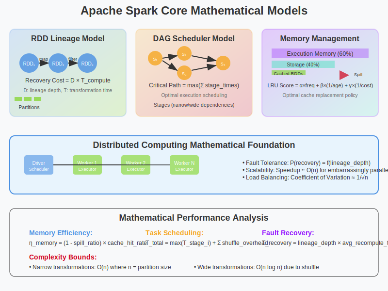

# Core Mathematical Models in Apache Spark



## Overview

Apache Spark's revolutionary performance in distributed computing stems from its sophisticated mathematical foundations. This section explores the core mathematical models that enable Spark to achieve fault-tolerant, high-performance distributed data processing through elegant abstractions and optimizations.

## 1. Resilient Distributed Datasets (RDD) Mathematical Model

### Mathematical Definition

An RDD can be formally defined as a mathematical structure:

```
RDD = (P, D, λ, L)
```

Where:
- **P**: Set of partitions `{p₁, p₂, ..., pₙ}`
- **D**: Distributed dataset across partitions
- **λ**: Transformation function lineage
- **L**: Location preferences for data locality

### Partition Mathematics

**Partition Function**: 
```
f: K → [0, n-1]
```
Where K is the key space and n is the number of partitions.

**Hash Partitioning**:
```
partition(key) = hash(key) mod n
```

**Range Partitioning**:
```
partition(key) = binary_search(boundaries, key)
```

### Lineage Graph Theory

**Lineage as Directed Acyclic Graph (DAG)**:
- **Vertices (V)**: RDD transformations
- **Edges (E)**: Data dependencies
- **Property**: Acyclic to enable fault recovery

**Mathematical Properties**:
- **Transitive Closure**: Complete dependency relationship
- **Topological Ordering**: Execution sequence optimization
- **Critical Path**: Longest dependency chain determining minimum execution time

### Fault Tolerance Mathematics

**Recovery Function**:
```
recover(lost_partition) = recompute(lineage_path)
```

**Cost Analysis**:
- **Replication Cost**: O(n × storage)  
- **Lineage Cost**: O(log n × computation)

**Narrow vs Wide Dependencies**:
- **Narrow**: `|child_partitions| = 1` per parent partition
- **Wide**: `|child_partitions| > 1` per parent partition (requires shuffle)

## 2. Directed Acyclic Graph (DAG) Scheduler Model

### Graph Representation

**Stage Decomposition Algorithm**:
```
function decomposeDAG(rdd):
    stages = []
    visited = set()
    
    def visit(r):
        if r in visited:
            return
        visited.add(r)
        
        stage = Stage()
        for parent in r.dependencies:
            if isShuffleDependency(parent):
                visit(parent)  # Recursively process parent stages
                stage.addShuffleDependency(parent)
            else:
                stage.addTask(parent)  # Add to current stage
        
        stage.addTask(r)
        stages.append(stage)
    
    visit(rdd)
    return topologicalSort(stages)
```

### Task Scheduling Mathematics

**Resource Allocation Model**:
```
minimize: Σ(i=1 to n) execution_time(task_i)
subject to:
    Σ(j=1 to m) resource_usage(task_j, executor_k) ≤ capacity(executor_k)
    precedence_constraints(DAG)
```

**Locality-Aware Scheduling**:
```
locality_score(task, executor) = {
    3 if data_local(task, executor)
    2 if rack_local(task, executor)  
    1 if any_executor(task, executor)
}
```

### Critical Path Analysis

**Longest Path Algorithm**:
```
function criticalPath(DAG):
    for vertex in topologicalOrder(DAG):
        vertex.distance = max(
            parent.distance + edge_weight(parent, vertex) 
            for parent in vertex.parents
        )
    return max(vertex.distance for vertex in DAG.vertices)
```

## 3. Memory Management Mathematical Model

### Cache Management Algorithm

**Least Recently Used (LRU) with Mathematical Scoring**:
```
score(rdd_partition) = α × access_frequency + 
                       β × (1 / time_since_access) + 
                       γ × (1 / recomputation_cost)
```

Where α, β, γ are weight parameters optimized through machine learning.

**Memory Allocation Model**:
```
memory_fraction(storage) = (total_memory × storage_fraction) / 
                          (1 - fraction_reserved_for_system)
```

**Spill Mathematics**:
```
spill_threshold = memory_limit × spill_fraction
evict_size = max(required_memory - available_memory, 0)
```

### Serialization Mathematics

**Binary Encoder Optimization**:
- **Compression Ratio**: `original_size / compressed_size`
- **Serialization Time Complexity**: O(n) where n is object count
- **Memory Footprint Reduction**: Up to 10x reduction through columnar encoding

## 4. Shuffle Operations Mathematical Model

### Hash-Based Shuffle

**Partitioning Function**:
```
bucket = hash(key) mod num_reducers
```

**I/O Complexity**:
- **Write Phase**: O(M × R) where M = mappers, R = reducers
- **Read Phase**: O(M × R) network transfers
- **Total Disk I/O**: O(M × R × record_size)

### Sort-Based Shuffle

**External Sort Algorithm**:
```
function externalSort(data, memory_limit):
    sorted_runs = []
    
    # Phase 1: Create sorted runs
    while data.hasNext():
        chunk = data.readChunk(memory_limit)
        sorted_chunk = quickSort(chunk)
        sorted_runs.append(writeToTempFile(sorted_chunk))
    
    # Phase 2: Merge sorted runs
    return mergeRuns(sorted_runs)
```

**Time Complexity**: O(n log n) where n is total data size

**Space Complexity**: O(memory_limit) due to external sorting

### Network Cost Model

**Shuffle Data Transfer**:
```
network_cost = Σ(i=1 to M) Σ(j=1 to R) transfer_cost(mapper_i, reducer_j)

transfer_cost(m, r) = data_size(m, r) × (network_latency + data_size(m, r) / bandwidth)
```

## 5. Query Optimization Mathematical Model

### Catalyst Optimizer Framework

**Rule-Based Optimization**:
```
Rule: Expression → Expression
RuleSet: Set of rules applied iteratively until fixed point

optimize(plan) = fixedPoint(applyRules(ruleSet), plan)
```

**Cost-Based Optimization**:
```
cost(plan) = CPU_cost + I/O_cost + Network_cost

CPU_cost = Σ operations × CPU_cycle_cost
I/O_cost = Σ data_scanned × I/O_latency  
Network_cost = Σ shuffle_data × network_latency
```

### Predicate Pushdown Mathematics

**Selectivity Estimation**:
```
selectivity(predicate) = |rows_satisfying_predicate| / |total_rows|

cost_reduction = original_cost × (1 - selectivity)
```

### Join Optimization

**Join Algorithm Selection**:
```
choose_join_algorithm(left_size, right_size, available_memory):
    if right_size < available_memory:
        return broadcast_hash_join
    elif left_size × right_size < threshold:
        return sort_merge_join  
    else:
        return shuffle_hash_join
```

## 6. Distributed Computing Theoretical Foundations

### CAP Theorem Application

Spark's design choices in the context of CAP theorem:
- **Consistency**: Eventually consistent through lineage-based recomputation
- **Availability**: High availability through multi-replica execution
- **Partition Tolerance**: Automatic handling of network partitions

### MapReduce Mathematical Extension

**Functional Programming Model**:
```
map: (K₁, V₁) → [(K₂, V₂)]
reduce: (K₂, [V₂]) → [(K₃, V₃)]

Spark Extension:
filter: (K, V) → Boolean
flatMap: (K, V) → [(K', V')]  
groupBy: [(K, V)] → [(K, [V])]
```

### Complexity Analysis

**Time Complexity**:
- **Narrow Transformations**: O(n) where n = partition size
- **Wide Transformations**: O(n log n) due to shuffle operations
- **Iterative Algorithms**: O(k × n) where k = iterations (vs O(k × n × I/O) in MapReduce)

**Space Complexity**:
- **Memory Storage**: O(cache_size)
- **Shuffle Buffers**: O(num_partitions × buffer_size)
- **Lineage Metadata**: O(transformation_depth)

## Mathematical Advantages Over Traditional Systems

### 1. **Memory Efficiency**
- **Traditional Systems**: O(n × iterations × I/O_cost)
- **Spark**: O(n × I/O_cost + iterations × CPU_cost)

### 2. **Fault Tolerance Cost**
- **Replication-based**: O(n × replication_factor × storage)
- **Lineage-based**: O(log n × computation + metadata)

### 3. **Iterative Algorithm Performance**
- **Disk-based Systems**: O(k × n × disk_latency)
- **Memory-based Spark**: O(n × disk_latency + k × n × memory_latency)

## Conclusion

Spark's mathematical foundations create a coherent framework for distributed computing that optimizes:
- **Computation through DAG optimization**
- **Memory usage through intelligent caching**
- **Network traffic through locality-aware scheduling**
- **Fault tolerance through mathematical lineage**

These mathematical models work together to provide the performance improvements that make Spark 10-100x faster than traditional MapReduce systems for iterative workloads.