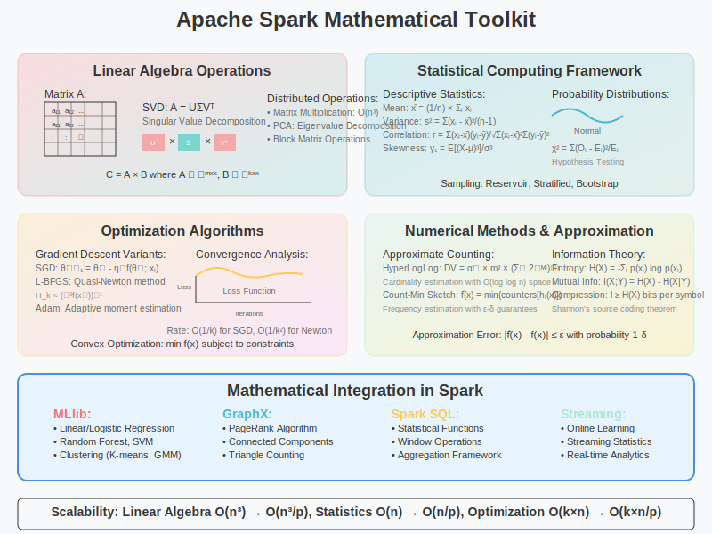

# Mathematical Toolkit in Apache Spark



## Overview

Apache Spark's computational power stems from its comprehensive mathematical toolkit that enables efficient distributed computation across diverse domains. This section explores the mathematical libraries, algorithms, and numerical methods that form the backbone of Spark's analytical capabilities.

## 1. Linear Algebra Foundations (MLlib.linalg)

### Distributed Matrix Operations

**Matrix Representations**:

```scala
// Dense Matrix - stored as column-major array
DenseMatrix(rows, cols, values: Array[Double])

// Sparse Matrix - compressed sparse column (CSC) format  
SparseMatrix(rows, cols, colPtrs: Array[Int], rowIndices: Array[Int], values: Array[Double])

// Block Matrix - distributed matrix in blocks
BlockMatrix(blocks: RDD[((Int, Int), Matrix)], rowsPerBlock, colsPerBlock)
```

**Mathematical Operations**:

**Matrix Multiplication**:
```
C = A × B where A ∈ ℝᵐˣᵏ, B ∈ ℝᵏˣⁿ, C ∈ ℝᵐˣⁿ

Distributed Algorithm:
1. Partition A by rows, B by columns
2. Broadcast smaller matrix if possible
3. Compute local products: cᵢⱼ = Σₖ aᵢₖ × bₖⱼ
4. Aggregate results across partitions
```

**Singular Value Decomposition (SVD)**:
```
A = UΣVᵀ where:
- A ∈ ℝᵐˣⁿ (input matrix)
- U ∈ ℝᵐˣᵏ (left singular vectors)  
- Σ ∈ ℝᵏˣᵏ (diagonal matrix of singular values)
- V ∈ ℝⁿˣᵏ (right singular vectors)
```

**Implementation**:
```scala
import org.apache.spark.mllib.linalg.distributed.RowMatrix

val mat = new RowMatrix(vectors)  // RDD[Vector]
val svd = mat.computeSVD(k = 50, computeU = true)

// Mathematical properties:
// ||A - U_k Σ_k V_k^T||_F minimized (optimal rank-k approximation)
// Computational complexity: O(mn²) for dense matrices
```

### Principal Component Analysis (PCA)

**Mathematical Foundation**:
```
Covariance Matrix: C = (1/n-1) × XᵀX where X is mean-centered

PCA Objective: max w^T C w subject to ||w|| = 1

Solution: w = eigenvectors of C corresponding to largest eigenvalues
```

**Spark Implementation**:
```scala
import org.apache.spark.ml.feature.PCA
import org.apache.spark.ml.linalg.Vectors

val pca = new PCA()
  .setInputCol("features")
  .setOutputCol("pca_features")
  .setK(10)  // Reduce to 10 dimensions

// Mathematical guarantee:
// Captures maximum variance in lower-dimensional space
// Variance retained = Σᵢ₌₁ᵏ λᵢ / Σᵢ₌₁ⁿ λᵢ
```

## 2. Statistical Computing Framework

### Descriptive Statistics

**Sample Statistics**:
```
Sample Mean: x̄ = (1/n) × Σᵢ₌₁ⁿ xᵢ
Sample Variance: s² = (1/n-1) × Σᵢ₌₁ⁿ (xᵢ - x̄)²
Standard Deviation: s = √s²
Skewness: γ₁ = E[(X - μ)³] / σ³
Kurtosis: γ₂ = E[(X - μ)⁴] / σ⁴ - 3
```

**Distributed Implementation**:
```scala
import org.apache.spark.sql.functions._

val stats = df.select(
  mean("value").as("mean"),
  stddev("value").as("std"),
  variance("value").as("variance"),
  skewness("value").as("skewness"),
  kurtosis("value").as("kurtosis")
)

// Computational complexity: O(n) single pass algorithm
// Memory complexity: O(1) streaming computation
```

### Correlation Analysis

**Pearson Correlation Coefficient**:
```
r = Σᵢ(xᵢ - x̄)(yᵢ - ȳ) / √[Σᵢ(xᵢ - x̄)² × Σᵢ(yᵢ - ȳ)²]

Properties:
- Range: [-1, 1]
- r = 1: Perfect positive linear relationship
- r = 0: No linear relationship
- r = -1: Perfect negative linear relationship
```

**Spearman Rank Correlation**:
```scala
import org.apache.spark.ml.stat.Correlation

val correlationMatrix = Correlation.corr(dataset, "features", "spearman")

// Rank-based correlation (non-parametric)
// Robust to outliers and non-linear monotonic relationships
```

### Hypothesis Testing

**Chi-Square Test of Independence**:
```
H₀: Variables are independent
H₁: Variables are dependent

Test Statistic: χ² = Σᵢⱼ (Oᵢⱼ - Eᵢⱼ)² / Eᵢⱼ

Where:
- Oᵢⱼ = observed frequency in cell (i,j)
- Eᵢⱼ = expected frequency = (row_total × col_total) / grand_total
```

**Kolmogorov-Smirnov Test**:
```scala
import org.apache.spark.ml.stat.Statistics

val ksTest = Statistics.kolmogorovSmirnovTest(data, "normal")

// Tests goodness of fit to specified distribution
// Test statistic: D = max|F_n(x) - F(x)|
// Where F_n(x) is empirical CDF, F(x) is theoretical CDF
```

## 3. Optimization Algorithms

### Gradient Descent Variants

**Stochastic Gradient Descent (SGD)**:
```
Parameter Update: θₜ₊₁ = θₜ - η∇f(θₜ; xᵢ)

Where:
- θ: parameters
- η: learning rate
- ∇f: gradient of loss function
- xᵢ: single training example
```

**Limited-memory BFGS (L-BFGS)**:
```
Quasi-Newton method that approximates inverse Hessian:

H_k ≈ (∇²f(xₖ))⁻¹

Update rule: x_{k+1} = x_k - α_k H_k ∇f(x_k)

Advantages:
- Superlinear convergence
- Memory efficient O(m) storage vs O(n²) for full Newton
- No need to compute Hessian explicitly
```

**Spark Implementation**:
```scala
import org.apache.spark.mllib.optimization.{LBFGS, LogisticGradient, SquaredL2Updater}

val lbfgs = new LBFGS(gradient, updater)
  .setNumCorrections(10)  // Memory parameter m
  .setConvergenceTol(1e-6)
  .setMaxNumIterations(100)

val (weights, loss) = lbfgs.optimize(data, initialWeights)
```

### Convex Optimization

**Linear Programming**:
```
Standard Form:
minimize    cᵀx
subject to  Ax = b
           x ≥ 0

Dual Form:
maximize    bᵀy
subject to  Aᵀy ≤ c
```

**Quadratic Programming**:
```
minimize    ½xᵀPx + qᵀx
subject to  Gx ≤ h
           Ax = b

Used in SVM optimization:
minimize ½||w||² subject to yᵢ(wᵀxᵢ + b) ≥ 1
```

## 4. Probabilistic Models and Sampling

### Random Sampling Methods

**Reservoir Sampling**:
```scala
// Select k items from stream of unknown size n
def reservoirSampling[T](stream: Iterator[T], k: Int): Array[T] = {
  val reservoir = Array.ofDim[T](k)
  var count = 0
  
  stream.foreach { item =>
    if (count < k) {
      reservoir(count) = item
    } else {
      val j = Random.nextInt(count + 1)
      if (j < k) reservoir(j) = item
    }
    count += 1
  }
  reservoir
}

// Mathematical guarantee: Each item has probability k/n of selection
```

**Stratified Sampling**:
```
Sample size from stratum i: nᵢ = n × (Nᵢ/N)

Where:
- n: total sample size
- Nᵢ: population size of stratum i  
- N: total population size

Variance: Var(ȳₛₜ) = Σᵢ (Nᵢ/N)² × (1-fᵢ) × σᵢ²/nᵢ
```

### Probability Distributions

**Normal Distribution**:
```
PDF: f(x) = (1/√(2πσ²)) × e^(-(x-μ)²/(2σ²))
CDF: Φ(x) = ∫₋∞ˣ f(t)dt

Spark Usage:
val normalRDD = sc.parallelize(Seq.fill(1000)(Random.nextGaussian()))
```

**Poisson Distribution**:
```scala
// For modeling count data and arrival processes
val poissonRDD = sc.parallelize(1 to 1000).map { _ =>
  val lambda = 3.5  // Average rate
  Random.nextPoisson(lambda)  
}

// Mean = Variance = λ
// Used in: event modeling, A/B testing, quality control
```

## 5. Numerical Methods and Approximation Algorithms

### Approximate Counting

**HyperLogLog Algorithm**:
```
Cardinality Estimation:
1. Hash each element to binary string
2. Count leading zeros in hash
3. Estimate cardinality: DV = αₘ × m² × (Σⱼ 2^(-Mⱼ))⁻¹

Where:
- m: number of buckets (power of 2)
- Mⱼ: maximum leading zeros in bucket j
- αₘ: bias correction constant
```

**Spark Implementation**:
```scala
import org.apache.spark.sql.functions.approx_count_distinct

val distinctCount = df.select(
  approx_count_distinct("user_id", 0.01).as("unique_users")
)

// Standard error ≈ 1.04/√m where m is number of buckets
// Memory usage: O(m) vs O(n) for exact counting
```

**Count-Min Sketch**:
```
Frequency Estimation:
1. Use k hash functions and m counters
2. Increment counters[hᵢ(x)] for each hash function i
3. Query: return min(counters[h₁(x)], ..., counters[hₖ(x)])

Error Bounds:
- Overestimation: f̂(x) ≥ f(x) always  
- With probability 1-δ: f̂(x) ≤ f(x) + ε||f||₁
```

### Interpolation and Approximation

**Linear Interpolation**:
```
Given points (x₀, y₀) and (x₁, y₁):
f(x) = y₀ + (y₁ - y₀) × (x - x₀)/(x₁ - x₀)

Used in: missing value imputation, time series analysis
```

**Polynomial Regression**:
```scala
import org.apache.spark.ml.regression.LinearRegression
import org.apache.spark.ml.feature.PolynomialExpansion

val polyExpansion = new PolynomialExpansion()
  .setInputCol("features")
  .setOutputCol("poly_features")
  .setDegree(3)  // Cubic polynomial

// Fits: y = β₀ + β₁x + β₂x² + β₃x³ + ε
// Minimizes: Σᵢ(yᵢ - ŷᵢ)² using normal equations
```

## 6. Graph Theory and Network Analysis

### Graph Algorithms in GraphX

**PageRank Algorithm**:
```
Mathematical Definition:
PR(u) = (1-d)/N + d × Σᵥ∈M(u) PR(v)/L(v)

Where:
- d: damping factor (typically 0.85)
- N: total number of pages
- M(u): set of pages linking to u
- L(v): number of outbound links from page v
```

**Connected Components**:
```scala
import org.apache.spark.graphx._

val graph = GraphLoader.edgeListFile(sc, "graph.txt")
val connectedComponents = graph.connectedComponents()

// Algorithm: Iterative vertex labeling
// Complexity: O(diameter × |E|) in worst case
// Finds: Weakly connected components in directed graphs
```

### Graph Metrics

**Clustering Coefficient**:
```
Local Clustering: Cᵢ = 2eᵢ / (kᵢ(kᵢ-1))

Where:
- eᵢ: number of edges among neighbors of vertex i
- kᵢ: degree of vertex i

Global Clustering: C = (1/n) × Σᵢ Cᵢ
```

**Betweenness Centrality**:
```
BC(v) = Σₛ≠ᵥ≠ₜ σₛₜ(v)/σₛₜ

Where:
- σₛₜ: number of shortest paths from s to t
- σₛₜ(v): number of shortest paths from s to t through v

Used for: identifying bridge nodes, information flow analysis
```

## 7. Time Series Analysis

### Moving Averages and Smoothing

**Simple Moving Average**:
```
SMA(t) = (1/k) × Σᵢ₌₀ᵏ⁻¹ x_{t-i}

Exponential Moving Average:
EMA(t) = α × x_t + (1-α) × EMA(t-1)

Where α = 2/(k+1) is smoothing parameter
```

**Seasonal Decomposition**:
```scala
// Additive model: X_t = T_t + S_t + R_t
// T_t: trend, S_t: seasonal, R_t: residual

import org.apache.spark.sql.functions._
import org.apache.spark.sql.expressions.Window

val window = Window.orderBy("timestamp").rowsBetween(-6, 6)
val trend = df.withColumn("trend", avg("value").over(window))
```

### Fourier Analysis

**Discrete Fourier Transform (DFT)**:
```
X_k = Σₙ₌₀ᴺ⁻¹ x_n × e^(-2πikn/N)

Fast Fourier Transform (FFT):
- Divide-and-conquer algorithm
- Complexity: O(N log N) vs O(N²) for naive DFT
- Used for: frequency domain analysis, filtering
```

## 8. Information Theory Applications

### Entropy and Information Gain

**Shannon Entropy**:
```
H(X) = -Σᵢ p(xᵢ) × log₂(p(xᵢ))

Conditional Entropy:
H(Y|X) = Σₓ p(x) × H(Y|X=x)

Information Gain:
IG(Y,X) = H(Y) - H(Y|X)
```

**Mutual Information**:
```scala
// Used in feature selection and dependency analysis
def mutualInformation(X: RDD[Double], Y: RDD[Double]): Double = {
  val jointDist = X.zip(Y).map { case (x, y) => (discretize(x), discretize(y)) }
    .countByValue()
    .mapValues(_.toDouble / X.count())
    
  // MI(X,Y) = Σₓ Σᵧ p(x,y) × log(p(x,y) / (p(x)×p(y)))
  computeMI(jointDist)
}
```

## Conclusion

Spark's mathematical toolkit provides a comprehensive foundation for:

1. **Linear Algebra**: Scalable matrix operations and decompositions
2. **Statistics**: Robust statistical analysis and hypothesis testing  
3. **Optimization**: Efficient algorithms for machine learning
4. **Probability**: Advanced sampling and distribution modeling
5. **Numerical Methods**: Approximate algorithms for big data
6. **Graph Theory**: Network analysis and graph algorithms
7. **Time Series**: Temporal data analysis and forecasting
8. **Information Theory**: Data analysis and feature engineering

These mathematical tools work together to enable Spark's powerful analytical capabilities across diverse domains and massive datasets.