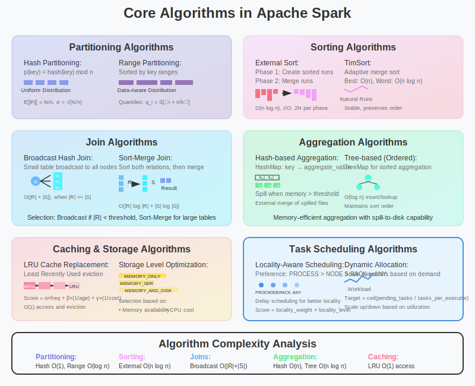

# Core Algorithms in Apache Spark



## Overview

Apache Spark's performance advantage over traditional distributed systems comes from its sophisticated algorithmic foundations. This section explores the key algorithms that enable Spark's efficient distributed data processing, from fundamental sorting and partitioning algorithms to advanced optimization strategies.

## 1. Partitioning Algorithms

### Hash Partitioning

**Mathematical Foundation**:
```
Partition Function: p(key) = hash(key) mod n

Where:
- hash(): Uniform hash function (e.g., MurmurHash3)
- n: Number of partitions
- Goal: Uniform distribution across partitions
```

**Load Balancing Analysis**:
```
Expected partition size: E[|Pᵢ|] = N/n

Variance: Var[|Pᵢ|] = N(1/n)(1 - 1/n)

Standard deviation: σ = √(N(n-1)/n²)

For large n: σ ≈ √(N/n)
```

**Spark Implementation**:
```scala
class HashPartitioner(partitions: Int) extends Partitioner {
  def getPartition(key: Any): Int = {
    val code = if (key == null) 0 else key.hashCode
    val mod = code % numPartitions
    if (mod < 0) mod + numPartitions else mod
  }
}

// Mathematical properties:
// - O(1) computation time
// - Expected uniform distribution
// - Good for operations requiring co-location (joins, groupBy)
```

### Range Partitioning

**Algorithm**:
```
1. Sample data to estimate key distribution
2. Sort samples and compute quantiles
3. Create n-1 boundary values
4. Assign records: partition i contains keys ∈ [bᵢ₋₁, bᵢ)
```

**Quantile Estimation**:
```
For sorted sample S of size s:
Quantile q: S[⌊q × s⌋]

Range boundaries: [min, q₁, q₂, ..., qₙ₋₁, max]
```

**Spark Implementation**:
```scala
class RangePartitioner[K: Ordering, V](
  partitions: Int,
  rdd: RDD[_ <: Product2[K, V]]) extends Partitioner {
  
  // Sample-based boundary computation
  private val rangeBounds: Array[K] = {
    val sampleSize = math.min(20 * partitions, 1e6.toInt)
    val sampleSizePerPartition = math.ceil(3.0 * sampleSize / rdd.partitions.length).toInt
    
    val sketched = rdd.sample(false, frac, 1)
      .map(_._1)
      .collect()
      .sorted
    
    if (sketched.length == 0) Array.empty
    else RangePartitioner.determineBounds(sketched, partitions)
  }
}

// Time complexity: O(log n) for partition lookup
// Space complexity: O(n) for boundary storage
```

### Custom Partitioning Strategies

**Geometric Partitioning** (for spatial data):
```
2D Space Partitioning:
- Quadtree: Recursively divide space into quadrants
- Grid: Regular grid with fixed cell size
- KD-tree: Alternating axis splits

Partition Function: p(point) = spatialHash(x, y)
```

**Temporal Partitioning**:
```scala
class TimePartitioner(partitions: Int, timeRange: (Long, Long)) extends Partitioner {
  private val (startTime, endTime) = timeRange
  private val intervalSize = (endTime - startTime) / partitions
  
  def getPartition(key: Any): Int = {
    val timestamp = key.asInstanceOf[Long]
    math.min(((timestamp - startTime) / intervalSize).toInt, partitions - 1)
  }
}

// Optimizes temporal queries and time-series operations
```

## 2. Sorting Algorithms

### External Sort Algorithm

**Problem**: Sort dataset larger than available memory

**Multi-Phase Algorithm**:
```
Phase 1: Create Sorted Runs
for each chunk of size M (memory limit):
    1. Load chunk into memory
    2. Sort using quicksort: O(M log M)
    3. Write sorted run to disk
    
Phase 2: Merge Sorted Runs
    1. Open k input streams (one per run)
    2. Use priority queue to merge: O(N log k)
    3. Write final sorted output
```

**Mathematical Analysis**:
```
Number of runs: R = ⌈N/M⌉
Merge complexity: O(N log R) = O(N log(N/M))
Total I/O: 2N (read once, write once per phase)
Memory usage: O(M + k) where k = number of runs
```

**Spark Implementation**:
```scala
class ExternalSorter[K, V, C](
  context: TaskContext,
  ordering: Option[Ordering[K]] = None,
  partitioner: Option[Partitioner] = None) {
  
  private val spillMap = new SizeTrackingAppendOnlyMap[K, C]
  
  def insertAll(records: Iterator[Product2[K, V]]): Unit = {
    records.foreach { case (k, v) =>
      if (spillMap.estimateSize() > memoryThreshold) {
        spill(spillMap)  // Write current map to disk
        spillMap.clear()
      }
      spillMap.update(k, v)
    }
  }
  
  private def merge(): Iterator[(K, C)] = {
    // Merge in-memory map with spilled files
    val spilledIterators = spilledFiles.map(readSpilledFile)
    new MergeIterator(spillMap.destructiveSortedIterator() +: spilledIterators)
  }
}
```

### TimSort Algorithm

**Hybrid Approach**: Combines merge sort and insertion sort
```
1. Identify naturally occurring runs in data
2. Extend short runs using binary insertion sort
3. Merge runs using sophisticated merge strategy
4. Maintain stack of pending merge operations
```

**Advantages**:
- **Adaptive**: O(n) for nearly sorted data
- **Stable**: Preserves relative order of equal elements  
- **Optimal**: O(n log n) worst-case performance

**Mathematical Properties**:
```
Best case: O(n) - already sorted data
Average case: O(n log n) - random data
Worst case: O(n log n) - reverse sorted data
Space complexity: O(n) - temporary merge space
```

## 3. Join Algorithms

### Broadcast Hash Join

**Algorithm**:
```
1. Broadcast smaller relation (R) to all executors
2. Hash R on join key: H = {key → records}
3. For each record in larger relation (S):
   a. Probe hash table: H[s.joinKey]
   b. Output matching pairs
```

**Mathematical Analysis**:
```
Conditions: |R| << |S| and |R| < broadcastThreshold

Time Complexity: O(|R| + |S|)
Space Complexity: O(|R|) per executor
Network Cost: O(|R| × numExecutors)

Optimal when: |R| × numExecutors < |R| × |S| / numPartitions
```

**Spark Implementation**:
```scala
case class BroadcastHashJoin(
  left: SparkPlan,
  right: SparkPlan,
  joinType: JoinType,
  condition: Option[Expression]) extends BinaryExecNode {
  
  override def doExecute(): RDD[InternalRow] = {
    val broadcastRelation = buildSide.executeBroadcast[HashedRelation]()
    
    streamSide.execute().mapPartitionsWithIndex { (idx, streamedIter) =>
      val hashedRelation = broadcastRelation.value
      
      streamedIter.flatMap { streamedRow =>
        val joinKey = boundCondition.eval(streamedRow)
        hashedRelation.get(joinKey).map { buildRow =>
          joinRows(streamedRow, buildRow)
        }
      }
    }
  }
}
```

### Sort-Merge Join

**Algorithm**:
```
1. Sort both relations on join key
2. Merge sorted relations using two-pointer technique
3. Handle duplicate keys with nested loop

Pseudocode:
i, j = 0, 0
while i < |R| and j < |S|:
    if R[i].key < S[j].key: i++
    elif R[i].key > S[j].key: j++  
    else: // keys match
        output all combinations of R[i...] and S[j...] with same key
        advance both pointers past matching groups
```

**Complexity Analysis**:
```
Sorting cost: O(|R| log |R| + |S| log |S|)
Merge cost: O(|R| + |S|)
Total: O(|R| log |R| + |S| log |S|)

Memory: O(1) streaming merge (after sorting)
Optimal for: Large datasets where broadcast is not feasible
```

### Hash-Based Shuffle Join

**Two-Phase Algorithm**:
```
Phase 1: Shuffle Phase
- Partition both relations on join key
- Redistribute data: records with same key → same partition

Phase 2: Local Join Phase  
- Build hash table from smaller relation's partition
- Probe hash table with larger relation's partition
```

**Cost Model**:
```
Shuffle cost: O((|R| + |S|) × log P) where P = parallelism
Hash build: O(min(|Rᵢ|, |Sᵢ|)) per partition i
Hash probe: O(max(|Rᵢ|, |Sᵢ|)) per partition i

Total: O((|R| + |S|) × (1 + log P))
```

**Skew Handling**:
```scala
// Salted keys to handle skew
def saltKey(key: Any, numSalts: Int): (Any, Int) = {
  (key, Random.nextInt(numSalts))
}

// Join with skew mitigation
val saltedR = R.map { case (k, v) => (saltKey(k, numSalts), v) }
val replicatedS = S.flatMap { case (k, v) => 
  (0 until numSalts).map(i => ((k, i), v))
}

saltedR.join(replicatedS)
  .map { case ((k, _), (v1, v2)) => (k, (v1, v2)) }
```

## 4. Aggregation Algorithms

### Hash-Based Aggregation

**Algorithm**:
```
1. Initialize hash map: key → aggregate_value
2. For each input record (key, value):
   a. If key exists: update aggregate
   b. Else: insert new entry
3. Output all (key, aggregate) pairs
```

**Memory Management**:
```scala
class SizeTrackingAppendOnlyMap[K, V] extends AppendOnlyMap[K, V] {
  private var currentSize: Long = 0L
  
  override def update(key: K, value: V): Unit = {
    val oldValue = super.apply(key)
    super.update(key, value)
    
    // Update size estimate
    if (oldValue == null) currentSize += estimateSize(key, value)
    else currentSize += estimateSize(key, value) - estimateSize(key, oldValue)
    
    // Spill if memory threshold exceeded
    if (currentSize > memoryThreshold) spill()
  }
}
```

**Spill Strategy**:
```
Memory threshold: fraction × availableMemory
Spill trigger: estimatedSize > threshold

Spill process:
1. Sort current map by key
2. Write to disk in chunks
3. Clear in-memory map
4. Continue processing

Final merge: Merge in-memory map with spilled files
```

### Tree-Based Aggregation

**For Ordered Aggregation**:
```scala
// Maintains sorted order during aggregation
class TreeAggregator[K: Ordering, V](combineFunc: (V, V) => V) {
  private val tree = new java.util.TreeMap[K, V]()
  
  def update(key: K, value: V): Unit = {
    val existing = tree.get(key)
    if (existing != null) {
      tree.put(key, combineFunc(existing, value))
    } else {
      tree.put(key, value)
    }
  }
  
  def iterator: Iterator[(K, V)] = tree.asScala.iterator
}

// Time complexity: O(log n) per update
// Space complexity: O(n) for tree structure
// Benefits: Maintains order, supports range queries
```

## 5. Caching and Storage Algorithms

### LRU Cache Implementation

**Least Recently Used Algorithm**:
```
Data structures:
- HashMap: key → (value, doubly_linked_list_node)
- Doubly linked list: maintains access order

Operations:
- GET: Move accessed item to front, O(1)
- PUT: Add to front, remove LRU if capacity exceeded, O(1)
```

**Spark's Memory Management**:
```scala
class MemoryStore(conf: SparkConf) {
  private val entries = new LinkedHashMap[BlockId, MemoryEntry[_]](
    initialCapacity = 32, loadFactor = 0.75f, accessOrder = true)
  
  def putBytes[T](blockId: BlockId, bytes: ChunkedByteBuffer): Boolean = {
    val entry = new SerializedMemoryEntry[T](bytes, MemoryMode.ON_HEAP, implicitly[ClassTag[T]])
    
    synchronized {
      val freeMemory = maxMemory - blocksMemoryUsed
      if (entry.size <= freeMemory) {
        entries.put(blockId, entry)
        blocksMemoryUsed += entry.size
        true
      } else {
        evictBlocksToFreeSpace(blockId, entry.size)
        entries.put(blockId, entry)
        blocksMemoryUsed += entry.size
        true
      }
    }
  }
}
```

### Storage Level Optimization

**Mathematical Model for Storage Decision**:
```
Storage Cost = α × memory_usage + β × cpu_cost + γ × network_cost

Where:
- α, β, γ: weight parameters
- memory_usage: serialization overhead
- cpu_cost: serialization/deserialization time
- network_cost: data transfer for cache misses

Optimal strategy: minimize total cost subject to memory constraints
```

**Storage Levels Comparison**:
```
MEMORY_ONLY: Fast access, high memory usage
MEMORY_ONLY_SER: Compact storage, CPU overhead for serialization  
MEMORY_AND_DISK: Balanced, spills to disk when memory full
DISK_ONLY: Slow but handles large datasets
OFF_HEAP: Reduces GC pressure, requires serialization

Selection algorithm:
if (data_size < available_memory × 0.6): MEMORY_ONLY
elif (cpu_intensive_workload): MEMORY_ONLY_SER
else: MEMORY_AND_DISK
```

## 6. Optimization Algorithms

### Catalyst Query Optimizer

**Rule-Based Optimization**:
```scala
object ConstantFolding extends Rule[LogicalPlan] {
  def apply(plan: LogicalPlan): LogicalPlan = plan transformExpressions {
    case Add(Literal(c1, dataType), Literal(c2, _)) if dataType.isInstanceOf[NumericType] =>
      Literal(c1.asInstanceOf[Number].doubleValue() + c2.asInstanceOf[Number].doubleValue())
    
    case Multiply(Literal(c, _), _) if c == 0 => Literal(0)
    case Multiply(_, Literal(c, _)) if c == 0 => Literal(0)
    case Multiply(Literal(c, _), expr) if c == 1 => expr
    case Multiply(expr, Literal(c, _)) if c == 1 => expr
  }
}

// Algebraic simplifications:
// x + 0 = x, x * 1 = x, x * 0 = 0
// (x + a) + b = x + (a + b)  [constant folding]
// x AND true = x, x OR false = x [boolean simplification]
```

**Cost-Based Optimization (CBO)**:
```
Cost Model:
cost(plan) = rows × width × cpu_cost + scan_cost + shuffle_cost

Statistics Collection:
- Table size: number of rows, size in bytes
- Column statistics: min, max, null count, distinct count
- Histogram: data distribution for skew detection

Join Reordering:
Dynamic programming approach for optimal join order
State space: O(2^n) for n relations
Pruning: eliminate suboptimal partial solutions
```

### Predicate Pushdown Algorithm

**Logical Optimization**:
```
Goal: Move filter operations as close to data source as possible

Benefits:
- Reduce data transfer: filter before shuffle
- Improve scan efficiency: skip irrelevant data
- Enable storage optimizations: column pruning, partition elimination

Algorithm:
1. Traverse query plan bottom-up
2. For each filter: determine pushable predicates  
3. Move filters below joins, aggregations when safe
4. Push to storage layer when supported (Parquet, Delta Lake)
```

**Safety Conditions**:
```scala
def canPushDown(filter: Expression, child: LogicalPlan): Boolean = {
  child match {
    case _: LeafNode => true  // Always safe to push to data sources
    case Project(projectList, _) => 
      // Safe if filter only references projected columns
      filter.references.subsetOf(projectList.flatMap(_.references).toSet)
    case Join(_, _, joinType, _) =>
      // For inner joins: can push to either side
      // For outer joins: more complex rules apply
      joinType == Inner && filter.references.subsetOf(child.outputSet)
    case _ => false
  }
}
```

## 7. Scheduling Algorithms

### Task Scheduling with Locality

**Locality-Aware Scheduling**:
```
Locality Levels (preference order):
1. PROCESS_LOCAL: Data in same JVM
2. NODE_LOCAL: Data on same machine  
3. RACK_LOCAL: Data in same rack
4. ANY: Data anywhere in cluster

Scoring Function:
score(task, executor) = locality_weight × locality_level + 
                       load_balance_weight × (1 / current_load)
```

**Delay Scheduling Algorithm**:
```scala
class TaskScheduler {
  private val localityWaits = Array(3000, 3000, 0)  // ms to wait for each level
  
  def scheduleTask(task: Task, availableExecutors: Seq[ExecutorInfo]): Option[ExecutorInfo] = {
    val localExecutors = getLocalExecutors(task, availableExecutors)
    
    if (localExecutors.nonEmpty) {
      Some(selectBestExecutor(localExecutors))
    } else if (task.waitTime < localityWaits(task.preferredLocality.ordinal())) {
      None  // Wait for better locality
    } else {
      // Relax locality requirement
      task.preferredLocality = relaxLocality(task.preferredLocality)
      scheduleTask(task, availableExecutors)
    }
  }
}
```

### Dynamic Resource Allocation

**Algorithm**:
```
Target Executors = ceil(pending_tasks / tasks_per_executor)

Scale Up Conditions:
- Queue backlog > scale_up_threshold
- Recent tasks waiting > max_delay
- Resource utilization > target_utilization

Scale Down Conditions:  
- Queue empty for > idle_timeout
- Resource utilization < min_utilization
- Executors idle for > executor_idle_timeout

Mathematical Model:
utilization(t) = active_tasks(t) / (num_executors × cores_per_executor)
target_executors(t+1) = utilization(t) × num_executors × scale_factor
```

## 8. Compression and Encoding Algorithms

### Columnar Compression

**Dictionary Encoding**:
```
Algorithm:
1. Build dictionary: unique_values → index
2. Replace values with indices
3. Store dictionary + encoded column

Compression Ratio:
original_size = num_rows × sizeof(value_type)
compressed_size = dict_size × sizeof(value_type) + num_rows × sizeof(index_type)

ratio = original_size / compressed_size
```

**Run-Length Encoding (RLE)**:
```scala
case class RLEEncoder[T](values: Array[T]) {
  def encode(): Array[(T, Int)] = {
    if (values.isEmpty) return Array.empty
    
    val result = ArrayBuffer[(T, Int)]()
    var current = values(0)
    var count = 1
    
    for (i <- 1 until values.length) {
      if (values(i) == current) {
        count += 1
      } else {
        result += ((current, count))
        current = values(i)
        count = 1
      }
    }
    result += ((current, count))
    result.toArray
  }
}

// Effective for columns with many consecutive duplicate values
// Compression ratio: original_length / num_distinct_runs
```

### Serialization Algorithms

**Kryo Serialization**:
```
Advantages over Java serialization:
- 10x smaller serialized size
- 10x faster serialization speed
- Custom serializers for optimized formats

Configuration:
conf.set("spark.serializer", "org.apache.spark.serializer.KryoSerializer")
conf.set("spark.kryo.registrationRequired", "true")  // Fail on unregistered classes
```

**Unsafe Serialization**:
```scala
// Direct memory access for maximum performance
class UnsafeRow(numFields: Int) {
  private var baseObject: AnyRef = _
  private var baseOffset: Long = _
  private var sizeInBytes: Int = _
  
  def setInt(ordinal: Int, value: Int): Unit = {
    Platform.putInt(baseObject, getFieldOffset(ordinal), value)
  }
  
  def getInt(ordinal: Int): Int = {
    Platform.getInt(baseObject, getFieldOffset(ordinal))  
  }
}

// Zero-copy serialization when possible
// Memory-efficient representation for SQL operations
```

## Conclusion

Spark's algorithmic foundations provide:

1. **Partitioning**: Optimal data distribution strategies
2. **Sorting**: Memory-efficient external sort algorithms  
3. **Joins**: Multiple strategies optimized for different data characteristics
4. **Aggregation**: Hash and tree-based approaches with spill handling
5. **Caching**: Intelligent memory management with LRU eviction
6. **Optimization**: Comprehensive query optimization framework
7. **Scheduling**: Locality-aware task assignment with dynamic scaling
8. **Compression**: Advanced encoding techniques for storage efficiency

These algorithms work synergistically to deliver Spark's exceptional performance across diverse workloads and cluster configurations.