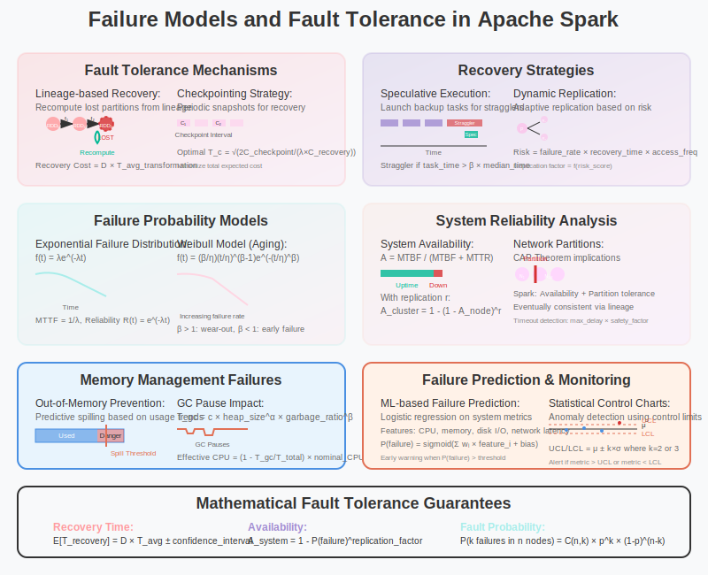

# Failure Models and Fault Tolerance in Apache Spark



## Overview

Apache Spark's robustness in production environments stems from its sophisticated mathematical approach to failure modeling and fault tolerance. This section explores the probabilistic models, recovery strategies, and mathematical foundations that enable Spark to maintain high availability and data consistency in the face of various failure scenarios.

## 1. Failure Classification and Mathematical Models

### Node Failure Models

**Exponential Failure Distribution**:
```
Node failure follows exponential distribution:
f(t) = λe^(-λt)  for t ≥ 0

Where:
- λ: failure rate (failures per unit time)
- MTTF (Mean Time To Failure) = 1/λ
- Reliability function: R(t) = e^(-λt)
```

**Failure Probability Analysis**:
```
Probability of node failure in time interval [0,t]:
P(failure ≤ t) = 1 - e^(-λt)

For small t: P(failure ≤ t) ≈ λt

Cluster with n nodes:
P(at least one failure) = 1 - (1 - λt)^n ≈ nλt for small λt
```

**Weibull Failure Model** (for wear-out failures):
```
f(t) = (β/η) × (t/η)^(β-1) × e^(-(t/η)^β)

Where:
- β: shape parameter (β < 1: decreasing failure rate, β > 1: increasing)
- η: scale parameter (characteristic life)
- Used for: disk failures, hardware aging
```

### Network Partition Models

**Network Reliability**:
```
Link availability: A_link = MTBF / (MTBF + MTTR)

Where:
- MTBF: Mean Time Between Failures
- MTTR: Mean Time To Repair

Path reliability (series system):
A_path = ∏(i=1 to n) A_i

Network partition probability:
P(partition) = 1 - A_path
```

**Byzantine Failure Model**:
```
In cluster of n nodes with f Byzantine failures:
- Safety: n ≥ 3f + 1
- Liveness: n ≥ 2f + 1

Probability of Byzantine behavior:
P(Byzantine) = Σ(k=f+1 to n) C(n,k) × p^k × (1-p)^(n-k)

Where p is probability of individual node being Byzantine
```

## 2. RDD Lineage-Based Recovery Model

### Lineage Graph Mathematics

**Recovery Cost Model**:
```
Recovery_Cost(RDD) = Σ(i ∈ lost_partitions) Recomputation_Cost(i)

Recomputation_Cost(partition) = Σ(op ∈ lineage_path) Cost(op)

Where lineage_path is the sequence of transformations from source to lost partition
```

**Lineage Depth Analysis**:
```
Expected lineage depth: E[D] = Σ(i=1 to ∞) i × P(depth = i)

For geometric distribution: P(depth = k) = (1-p)^(k-1) × p
E[D] = 1/p

Recovery time: T_recovery = D × avg_transformation_time
```

**Checkpoint Optimization**:
```
Optimal checkpoint frequency to minimize total cost:
Total_Cost = Checkpoint_Cost × frequency + Recovery_Cost × failure_rate

Minimize: C_checkpoint × f + C_recovery × λ × E[lineage_depth]

Optimal frequency: f* = √(λ × C_recovery × E[D] / C_checkpoint)
```

### Narrow vs Wide Dependencies Recovery

**Narrow Dependency Recovery**:
```
Recovery complexity: O(1) per lost partition
- Lost partition can be recomputed independently
- No cross-partition data shuffling required
- Locality preserved during recovery

Mathematical guarantee:
If partition P_i is lost, recovery affects only P_i
Recovery_time(P_i) = Lineage_depth(P_i) × avg_computation_time
```

**Wide Dependency Recovery**:
```
Recovery complexity: O(k) where k is number of parent partitions
- May require recomputing multiple parent partitions  
- Shuffle operations need to be re-executed
- Cascading recovery possible

Worst case: Complete stage recomputation
Recovery_time = max(Recovery_time(parent_partition_i)) for all i
```

## 3. Probabilistic Failure Analysis

### Availability Mathematics

**System Availability Model**:
```
Single node availability: A_node = MTBF / (MTBF + MTTR)

Spark cluster availability (with replication factor r):
A_cluster = 1 - (1 - A_node)^r

For A_node = 0.99 and r = 3:
A_cluster = 1 - (1 - 0.99)³ = 1 - 0.000001 = 0.999999 (99.9999%)
```

**Data Loss Probability**:
```
With replication factor r and node failure probability p:
P(data_loss) = p^r

For p = 0.01 (1% failure rate):
- r = 1: P(data_loss) = 0.01 (1%)
- r = 2: P(data_loss) = 0.0001 (0.01%) 
- r = 3: P(data_loss) = 0.000001 (0.0001%)
```

### Failure Correlation Models

**Independent Failures**:
```
P(k failures in n nodes) = C(n,k) × p^k × (1-p)^(n-k)

Expected number of failures: E[failures] = n × p
Variance: Var[failures] = n × p × (1-p)
```

**Correlated Failures** (rack-level):
```
Hierarchical failure model:
- Rack failure probability: p_rack
- Node failure probability (given rack OK): p_node

P(node failure) = p_rack + (1 - p_rack) × p_node

Effective availability with rack awareness:
A_effective = A_rack × A_node_given_rack
```

## 4. Recovery Strategies and Algorithms

### Checkpoint-Based Recovery

**Checkpoint Frequency Optimization**:
```
Let:
- T_c: checkpoint interval
- λ: failure rate  
- C_checkpoint: cost of creating checkpoint
- C_recovery: cost of recovery from failure

Expected cost per unit time:
Cost(T_c) = C_checkpoint/T_c + λ × C_recovery × T_c/2

Minimize by taking derivative:
dCost/dT_c = -C_checkpoint/T_c² + λ × C_recovery/2 = 0

Optimal interval: T_c* = √(2 × C_checkpoint / (λ × C_recovery))
```

**Incremental Checkpointing**:
```scala
class IncrementalCheckpoint[T](rdd: RDD[T]) {
  private var lastCheckpoint: Option[RDD[T]] = None
  private var deltaOperations: List[Operation] = List.empty
  
  def checkpoint(): Unit = {
    val changes = computeDelta(lastCheckpoint, rdd)
    if (changes.size > threshold) {
      // Full checkpoint
      rdd.checkpoint()
      lastCheckpoint = Some(rdd)
      deltaOperations = List.empty
    } else {
      // Incremental checkpoint
      persistDelta(changes)
      deltaOperations = deltaOperations :+ currentOperation
    }
  }
  
  def recover(): RDD[T] = {
    lastCheckpoint match {
      case Some(base) => applyDeltas(base, deltaOperations)
      case None => recomputeFromLineage()
    }
  }
}
```

### Speculative Execution

**Straggler Detection Algorithm**:
```
Task completion prediction:
predicted_time(task) = α × median_time + (1-α) × current_elapsed_time

Straggler threshold: task_time > β × median_time

Where:
- α: weight parameter (typically 0.75)
- β: straggler multiplier (typically 1.5)
```

**Mathematical Analysis**:
```
Let X = task completion time (random variable)
Straggler probability: P(X > β × E[X])

For exponential distribution: P(straggler) = e^(-β)
For β = 1.5: P(straggler) ≈ 0.223 (22.3%)

Speculative execution benefit:
Speedup = E[min(X_original, X_speculative)] / E[X_original]
```

### Dynamic Replication

**Adaptive Replication Algorithm**:
```scala
class AdaptiveReplication {
  def computeReplicationFactor(partition: Partition): Int = {
    val failureRate = estimateFailureRate(partition.location)
    val recoveryTime = estimateRecoveryTime(partition)
    val accessFrequency = getAccessFrequency(partition)
    
    val riskScore = failureRate × recoveryTime × accessFrequency
    
    riskScore match {
      case r if r < lowThreshold => 1      // No replication
      case r if r < mediumThreshold => 2   // Single backup
      case r if r < highThreshold => 3     // Double backup
      case _ => 4                          // Triple backup
    }
  }
  
  def updateReplication(): Unit = {
    partitions.foreach { partition =>
      val currentReplicas = getCurrentReplicas(partition)
      val targetReplicas = computeReplicationFactor(partition)
      
      if (targetReplicas > currentReplicas) {
        createReplicas(partition, targetReplicas - currentReplicas)
      } else if (targetReplicas < currentReplicas) {
        removeReplicas(partition, currentReplicas - targetReplicas)
      }
    }
  }
}
```

## 5. Fault-Tolerant Shuffle Operations

### Shuffle Failure Recovery

**Shuffle Data Recovery Model**:
```
Shuffle write failures:
- Map task failure: Re-execute map stage
- Shuffle file corruption: Re-compute affected map outputs
- Network failure: Retry fetch with exponential backoff

Recovery cost: C_shuffle = n_maps × C_map + network_overhead

Where n_maps is number of map tasks to re-execute
```

**External Shuffle Service**:
```
Availability improvement with external shuffle service:
A_shuffle = A_node × A_external_service

Without external service:
P(shuffle_loss | node_failure) = 1.0

With external service:
P(shuffle_loss | node_failure) = P(service_failure) << 1.0

Expected recovery time reduction:
Reduction = (1 - A_external) × avg_shuffle_recovery_time
```

### Push-Based Shuffle

**Mathematical Model**:
```
Traditional pull-based shuffle:
- Fetch failures: P(failure) = 1 - (1 - p_node)^n_reducers
- Recovery time: T_recovery = failed_fetches × retry_time

Push-based shuffle:
- Server-side aggregation reduces network traffic
- Pre-merge reduces reducer load
- Failure isolation: only affected blocks need recovery

Network efficiency:
Traffic_reduction = (n_mappers × n_reducers - n_blocks) × avg_block_size
```

## 6. Memory Management Failure Models

### Out-of-Memory (OOM) Prevention

**Memory Usage Prediction**:
```
Memory demand model:
M(t) = M_base + Σ(i=1 to n) M_task(i) × active(i,t)

Where:
- M_base: baseline memory usage
- M_task(i): memory requirement of task i  
- active(i,t): binary indicator if task i is active at time t

OOM probability:
P(OOM) = P(M(t) > M_available)
```

**Spill Strategy Optimization**:
```scala
class MemoryManager {
  def shouldSpill(currentMemory: Long, requestedMemory: Long): Boolean = {
    val predictedMemory = currentMemory + requestedMemory
    val availableMemory = getAvailableMemory()
    
    // Predictive spilling based on memory trend
    val memoryTrend = estimateMemoryTrend()
    val futureMemory = predictedMemory + memoryTrend * lookAheadTime
    
    val spillThreshold = availableMemory * spillRatio
    
    futureMemory > spillThreshold
  }
  
  def selectSpillTarget(): Option[Spillable] = {
    val spillCandidates = getSpillableCaches()
    
    // Multi-objective optimization
    spillCandidates.minByOption { cache =>
      val reuseScore = cache.accessFrequency / (currentTime - cache.lastAccess)
      val recomputeScore = cache.recomputationCost
      val sizeScore = cache.memorySize
      
      // Weighted scoring function
      α × (1.0 / reuseScore) + β × recomputeScore + γ × (1.0 / sizeScore)
    }
  }
}
```

### Garbage Collection Impact

**GC Pause Model**:
```
GC pause time: T_gc = f(heap_size, garbage_ratio)

For concurrent mark-sweep:
T_gc ≈ c × heap_size^α × garbage_ratio^β

Where:
- α ≈ 0.8 (sublinear scaling)
- β ≈ 1.2 (superlinear with garbage ratio)
- c: GC algorithm constant

Impact on task execution:
Effective_CPU = nominal_CPU × (1 - T_gc / T_total)
```

## 7. Network Failure Models

### Network Partition Handling

**CAP Theorem in Spark Context**:
```
Spark's design choices:
- Consistency: Eventually consistent through lineage recomputation
- Availability: Prioritized through replication and speculative execution  
- Partition tolerance: Handled through timeout and retry mechanisms

Partition detection:
heartbeat_timeout = max_acceptable_delay × safety_factor

False positive rate:
P(false_positive) = P(delay > timeout | node_alive)
```

**Network Congestion Model**:
```
Congestion probability: P(congestion) = ρ^n / (1 - ρ + ρ^n)

Where:
- ρ: network utilization ratio
- n: number of competing flows

Expected delay with congestion:
E[delay] = base_delay / (1 - ρ) + congestion_penalty × P(congestion)
```

### Retry and Backoff Strategies

**Exponential Backoff Algorithm**:
```scala
class RetryPolicy {
  def nextRetryDelay(attempt: Int, lastDelay: Duration): Duration = {
    val exponentialDelay = initialDelay * math.pow(backoffMultiplier, attempt)
    val jitteredDelay = exponentialDelay * (1.0 + random.nextDouble() * jitterFactor)
    
    Duration(math.min(jitteredDelay, maxDelay.toMillis), TimeUnit.MILLISECONDS)
  }
  
  def shouldRetry(attempt: Int, exception: Throwable): Boolean = {
    attempt < maxRetries && isRetriableException(exception)
  }
}

// Mathematical analysis:
// Expected total delay: E[total_delay] = Σ(i=0 to n) delay(i) × P(fail_i)
// Success probability after n retries: P(success) = 1 - p^(n+1)
```

## 8. Distributed Consensus and Coordination

### Leader Election Failures

**Raft Algorithm in Spark Context**:
```
Leader election timeout: randomized between [T, 2T]
Heartbeat interval: T/10 (rule of thumb)

Split-brain prevention:
Majority requirement: votes > n/2

Availability during leader failure:
Unavailable_time = election_timeout + time_to_synchronize

Expected availability: A = MTTF / (MTTF + election_timeout)
```

### Distributed State Management

**Consensus Failure Model**:
```
Byzantine fault tolerance requirement:
- Safety: n ≥ 3f + 1 nodes for f Byzantine failures
- Liveness: n ≥ 2f + 1 nodes

Probability of consensus failure:
P(consensus_failure) = P(more than f nodes fail simultaneously)
= Σ(k=f+1 to n) C(n,k) × p^k × (1-p)^(n-k)
```

## 9. Monitoring and Failure Prediction

### Predictive Failure Analysis

**Machine Learning for Failure Prediction**:
```scala
case class NodeHealthMetrics(
  cpuUtilization: Double,
  memoryUsage: Double,
  diskIOPS: Double,
  networkLatency: Double,
  gcPauseTime: Double,
  taskFailureRate: Double
)

class FailurePredictionModel {
  def predictFailure(metrics: NodeHealthMetrics): FailureProbability = {
    // Features engineering
    val features = Array(
      metrics.cpuUtilization,
      metrics.memoryUsage,
      math.log(metrics.diskIOPS + 1),
      metrics.networkLatency,
      metrics.gcPauseTime,
      metrics.taskFailureRate
    )
    
    // Logistic regression model
    val probability = sigmoid(weights.zip(features).map { case (w, f) => w * f }.sum + bias)
    
    FailureProbability(probability, confidence = computeConfidence(features))
  }
  
  private def sigmoid(x: Double): Double = 1.0 / (1.0 + math.exp(-x))
}
```

**Early Warning System**:
```
Anomaly detection using statistical control charts:

Control limits:
UCL = μ + k × σ  (Upper Control Limit)
LCL = μ - k × σ  (Lower Control Limit)

Where:
- μ: historical mean of metric
- σ: historical standard deviation  
- k: control chart constant (typically 2 or 3)

Alert trigger: metric > UCL or metric < LCL
```

## Conclusion

Spark's fault tolerance is built on solid mathematical foundations:

1. **Probabilistic Models**: Quantify failure risks and optimize recovery strategies
2. **Lineage-Based Recovery**: Mathematical guarantees for data consistency
3. **Adaptive Strategies**: Dynamic optimization based on failure patterns
4. **Resource Management**: Proactive failure prevention through monitoring
5. **Consensus Algorithms**: Distributed coordination with Byzantine fault tolerance
6. **Performance Analysis**: Mathematical models for availability and recovery time

These mathematical approaches enable Spark to achieve high availability and fault tolerance while maintaining performance in large-scale distributed environments.