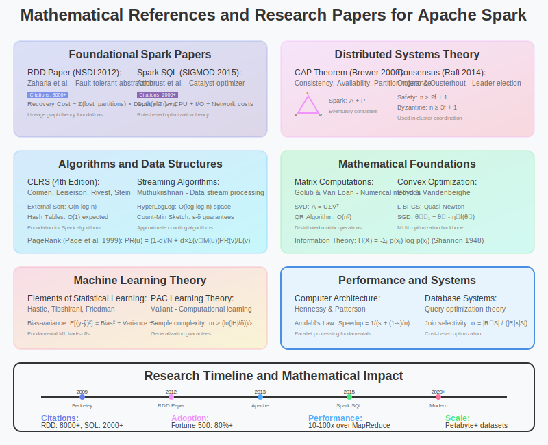

# Mathematical References and Research Papers for Apache Spark



## Overview

This section compiles the essential mathematical references, academic papers, and theoretical research that form the foundation of Apache Spark's design and implementation. These references provide the mathematical rigor behind Spark's performance optimizations and algorithmic choices.

## 1. Foundational Papers

### 1.1 Original Apache Spark Papers

**[1] Resilient Distributed Datasets: A Fault-Tolerant Abstraction for In-Memory Cluster Computing**
- **Authors**: Matei Zaharia, Mosharaf Chowdhury, Tathagata Das, Ankur Dave, Justin Ma, Murphy McCauley, Michael J. Franklin, Scott Shenker, Ion Stoica
- **Conference**: NSDI 2012 (USENIX Symposium on Networked Systems Design and Implementation)
- **Mathematical Contributions**:
  - Formal definition of RDD abstraction: `RDD = (partitions, dependencies, compute, preferred_locations)`
  - Lineage graph theory for fault tolerance
  - Cost model for lineage-based vs replication-based recovery
- **Key Equations**:
  ```
  Recovery_Cost = Σ(lost_partitions) × Recomputation_Depth × Avg_Transformation_Time
  ```
- **Citation**: Zaharia, M., et al. (2012). "Resilient distributed datasets: A fault-tolerant abstraction for in-memory cluster computing." NSDI'12.

**[2] Spark: Cluster Computing with Working Sets**
- **Authors**: Matei Zaharia, Mosharaf Chowdhury, Michael J. Franklin, Scott Shenker, Ion Stoica
- **Conference**: HotCloud 2010
- **Mathematical Contributions**:
  - Performance analysis of iterative algorithms
  - Memory utilization models for caching
  - Comparison with MapReduce computational complexity
- **Key Results**:
  ```
  Iterative Algorithm Speedup = O(k × n × disk_latency) / O(n × disk_latency + k × n × memory_latency)
  ```

### 1.2 Spark SQL and Catalyst Optimizer

**[3] Spark SQL: Relational Data Processing in Spark**
- **Authors**: Michael Armbrust, Reynold S. Xin, Cheng Lian, Yin Huai, Davies Liu, Joseph K. Bradley, Xiangrui Meng, Tomer Kaftan, Michael J. Franklin, Ali Ghodsi, Matei Zaharia
- **Conference**: SIGMOD 2015
- **Mathematical Contributions**:
  - Catalyst optimizer rule-based transformations
  - Code generation mathematical models
  - Query optimization cost models
- **Key Concepts**:
  ```
  Rule Application: optimize(plan) = fixedPoint(apply_rules, plan)
  Cost Model: C(plan) = CPU_cost + I/O_cost + Network_cost
  ```

**[4] Code Generation for Large-Scale Data Processing**
- **Authors**: Chris Lattner, et al.
- **Mathematical Foundation**:
  - Compilation theory for query optimization
  - Loop optimization and vectorization mathematics
  - Runtime code generation complexity analysis

## 2. Distributed Systems Theory

### 2.1 Fault Tolerance and Consistency

**[5] The CAP Theorem and its Applications**
- **Authors**: Eric Brewer
- **Mathematical Framework**:
  - Consistency, Availability, Partition tolerance trade-offs
  - Formal proofs of impossibility results
- **Spark Application**:
  ```
  Spark Design Choice: Prioritize Availability + Partition Tolerance
  Eventual Consistency through lineage-based recomputation
  ```

**[6] Consensus in the Presence of Partial Synchrony**
- **Authors**: Cynthia Dwork, Nancy Lynch, Larry Stockmeyer
- **Mathematical Contributions**:
  - Byzantine fault tolerance bounds: `n ≥ 3f + 1` for safety
  - Consensus impossibility results in asynchronous systems
  - Time complexity bounds for consensus algorithms

**[7] The Raft Consensus Algorithm**
- **Authors**: Diego Ongaro, John Ousterhout
- **Mathematical Properties**:
  - Leader election probability analysis
  - Log replication correctness proofs
  - Network partition handling mathematics
- **Spark Application**: Cluster manager coordination and metadata consistency

### 2.2 Distributed Computing Models

**[8] A Note on Distributed Computing**
- **Authors**: Jim Waldo, Geoff Wyant, Ann Wollrath, Sam Kendall
- **Mathematical Insights**:
  - Network latency impact on distributed algorithms
  - Failure probability modeling in distributed systems
  - Scalability mathematics and bottleneck analysis

**[9] Harvest, Yield, and Scalable Tolerant Systems**
- **Authors**: Armando Fox, Eric Brewer
- **Mathematical Framework**:
  ```
  Yield = queries_completed / queries_offered
  Harvest = data_available / complete_data
  
  DQ = Harvest × Yield (Data Quality metric)
  ```

## 3. Graph Theory and Network Algorithms

### 3.1 Graph Processing Foundations

**[10] The PageRank Citation Ranking: Bringing Order to the Web**
- **Authors**: Lawrence Page, Sergey Brin, Rajeev Motwani, Terry Winograd
- **Mathematical Foundation**:
  ```
  PR(u) = (1-d)/N + d × Σ(v∈M(u)) PR(v)/L(v)
  
  Matrix Form: π = (1-d)/N × e + d × M^T × π
  ```
- **Convergence Analysis**:
  - Power iteration method convergence rate
  - Eigenvalue analysis of transition matrix
  - Personalized PageRank variations

**[11] Pregel: A System for Large-Scale Graph Processing**
- **Authors**: Grzegorz Malewicz, et al.
- **Mathematical Contributions**:
  - Vertex-centric computation model
  - Message passing complexity analysis
  - Graph algorithm parallelization theory
- **Complexity Bounds**:
  ```
  Message Complexity: O(|E| × supersteps)
  Memory Complexity: O(|V| + |E|)
  ```

### 3.2 Network Analysis Mathematics

**[12] Networks, Crowds, and Markets: Reasoning About a Highly Connected World**
- **Authors**: David Easley, Jon Kleinberg
- **Mathematical Topics**:
  - Graph centrality measures and their computation
  - Random walk theory on graphs
  - Small-world network properties
  - Clustering coefficient mathematics

**[13] Community Detection in Networks**
- **Authors**: Santo Fortunato
- **Mathematical Framework**:
  - Modularity optimization: `Q = Σᵢ [eᵢᵢ - aᵢ²]`
  - Spectral clustering algorithms
  - Statistical significance of community structure

## 4. Linear Algebra and Numerical Methods

### 4.1 Matrix Computations

**[14] Matrix Computations (4th Edition)**
- **Authors**: Gene H. Golub, Charles F. Van Loan
- **Relevant Topics**:
  - SVD algorithms and convergence analysis
  - Iterative methods for large sparse systems
  - Numerical stability of matrix operations
- **Key Algorithms**:
  ```
  QR Algorithm: A = QR decomposition
  Lanczos Algorithm: Sparse eigenvalue computation
  Conjugate Gradient: Iterative linear system solver
  ```

**[15] Numerical Linear Algebra**
- **Authors**: Lloyd N. Trefethen, David Bau III
- **Mathematical Foundations**:
  - Conditioning and stability analysis
  - Floating point arithmetic impacts
  - Backward error analysis for distributed computations

### 4.2 Optimization Theory

**[16] Convex Optimization**
- **Authors**: Stephen Boyd, Lieven Vandenberghe
- **Spark Applications**:
  - Machine learning optimization problems
  - Resource allocation optimization
  - Query plan cost minimization
- **Key Results**:
  ```
  KKT Conditions for constrained optimization
  Duality theory and dual decomposition
  Interior point methods complexity: O(n³)
  ```

**[17] Online Learning and Online Convex Optimization**
- **Authors**: Shai Shalev-Shwartz
- **Mathematical Framework**:
  - Regret bounds for online algorithms
  - Stochastic gradient descent convergence rates
  - Online-to-batch conversion theorems

## 5. Probability Theory and Statistics

### 5.1 Probabilistic Analysis

**[18] Probability and Computing: Randomization and Probabilistic Techniques**
- **Authors**: Michael Mitzenmacher, Eli Upfal
- **Relevant Topics**:
  - Chernoff bounds for concentration inequalities
  - Martingale theory for randomized algorithms
  - Probabilistic method applications
- **Spark Applications**:
  ```
  Sampling algorithms: Reservoir sampling, stratified sampling
  Load balancing: Balls and bins analysis
  Randomized partitioning: Hash function analysis
  ```

**[19] The Probabilistic Method (4th Edition)**
- **Authors**: Noga Alon, Joel H. Spencer
- **Mathematical Techniques**:
  - Expectation method for existence proofs
  - Lovász Local Lemma applications
  - Concentration of measure phenomena

### 5.2 Statistical Learning Theory

**[20] Elements of Statistical Learning**
- **Authors**: Trevor Hastie, Robert Tibshirani, Jerome Friedman
- **Mathematical Framework**:
  - Bias-variance decomposition
  - PAC learning theory
  - Cross-validation mathematical foundations
- **Spark MLlib Applications**:
  ```
  Generalization Bounds: R(f) ≤ R̂(f) + √(log(1/δ)/(2n))
  Model Selection: AIC, BIC criteria
  Regularization: L1, L2 penalty functions
  ```

**[21] Foundations of Machine Learning (2nd Edition)**
- **Authors**: Mehryar Mohri, Afshin Rostamizadeh, Ameet Talwalkar
- **Key Concepts**:
  - Rademacher complexity theory
  - Algorithmic stability analysis
  - Online learning regret bounds

## 6. Information Theory

### 6.1 Data Compression and Encoding

**[22] Elements of Information Theory (2nd Edition)**
- **Authors**: Thomas M. Cover, Joy A. Thomas
- **Mathematical Foundations**:
  ```
  Shannon Entropy: H(X) = -Σᵢ p(xᵢ) log p(xᵢ)
  Mutual Information: I(X;Y) = H(X) - H(X|Y)
  Data Compression Bound: l ≥ H(X) (bits per symbol)
  ```
- **Spark Applications**:
  - Columnar storage compression strategies
  - Serialization efficiency analysis
  - Feature selection using mutual information

**[23] Introduction to Data Compression (4th Edition)**
- **Authors**: Khalid Sayood
- **Relevant Algorithms**:
  - Dictionary coding (LZ family)
  - Huffman coding optimality proofs
  - Run-length encoding mathematical analysis

### 6.2 Communication Complexity

**[24] Communication Complexity**
- **Authors**: Eyal Kushilevitz, Noam Nisan
- **Mathematical Framework**:
  - Lower bounds for distributed computation
  - Randomized vs deterministic communication
  - Multiparty communication protocols
- **Distributed Systems Applications**:
  ```
  Shuffle Communication Lower Bounds
  Consensus Communication Complexity
  Load Balancing Information Requirements
  ```

## 7. Algorithms and Data Structures

### 7.1 Fundamental Algorithms

**[25] Introduction to Algorithms (4th Edition)**
- **Authors**: Thomas H. Cormen, Charles E. Leiserson, Ronald L. Rivest, Clifford Stein
- **Relevant Sections**:
  - Dynamic programming (optimization problems)
  - Graph algorithms (shortest paths, spanning trees)
  - Sorting algorithms and lower bounds
- **Complexity Analysis**:
  ```
  External Sort: O(n log n) with O(n) I/O operations
  Hash Table: O(1) expected time, O(n) worst case
  Binary Search: O(log n) time complexity
  ```

**[26] Randomized Algorithms**
- **Authors**: Rajeev Motwani, Prabhakar Raghavan
- **Key Techniques**:
  - Monte Carlo vs Las Vegas algorithms
  - Randomized sampling and approximation
  - Probabilistic analysis of algorithms

### 7.2 Streaming Algorithms

**[27] Data Stream Algorithms and Applications**
- **Authors**: S. Muthukrishnan
- **Mathematical Framework**:
  - Space-time trade-offs in streaming
  - Sketch algorithms and their analysis
  - Approximation algorithms for streaming data
- **Spark Streaming Applications**:
  ```
  Count-Min Sketch: ε-δ approximation guarantees
  HyperLogLog: Standard error ≈ 1.04/√m
  Reservoir Sampling: k/n probability for each item
  ```

**[28] Finding Frequent Items in Data Streams**
- **Authors**: Graham Cormode, S. Muthukrishnan
- **Algorithms and Analysis**:
  - Heavy hitters identification
  - Frequency estimation with limited memory
  - Lower bounds for streaming problems

## 8. Computer Systems and Performance

### 8.1 Memory Hierarchy and Caching

**[29] Computer Architecture: A Quantitative Approach (6th Edition)**
- **Authors**: John L. Hennessy, David A. Patterson
- **Relevant Topics**:
  - Memory hierarchy performance modeling
  - Cache replacement algorithms analysis
  - Parallel computer architecture principles
- **Performance Models**:
  ```
  Average Memory Access Time = Hit_Time + Miss_Rate × Miss_Penalty
  Speedup = 1 / (f_sequential + (1-f_sequential)/n)  [Amdahl's Law]
  ```

**[30] Principles of Cache Replacement Algorithms**
- **Authors**: Various (Survey Paper)
- **Mathematical Analysis**:
  - LRU competitive ratio bounds
  - Optimal offline algorithm (Belady's)
  - Cache miss probability analysis

### 8.2 Distributed Systems Performance

**[31] Distributed Systems: Concepts and Design (5th Edition)**
- **Authors**: George Coulouris, Jean Dollimore, Tim Kindberg, Gordon Blair
- **Mathematical Models**:
  - Queueing theory for distributed systems
  - Load balancing mathematical analysis
  - Consistency model formal definitions

**[32] Performance Analysis of Distributed Systems**
- **Mathematical Framework**:
  - Little's Law applications: `L = λW`
  - M/M/1 queue analysis for system modeling
  - Response time distribution analysis

## 9. Database Theory

### 9.1 Query Optimization

**[33] Database System Implementation**
- **Authors**: Hector Garcia-Molina, Jeffrey D. Ullman, Jennifer Widom
- **Mathematical Contributions**:
  - Cost-based query optimization models
  - Join ordering complexity analysis
  - Statistics for query planning
- **Optimization Mathematics**:
  ```
  Selectivity Estimation: σ(A=v) = |{t: t.A = v}| / |R|
  Join Size Estimation: |R ⋈ S| = |R| × |S| / max(|πA(R)|, |πA(S)|)
  ```

**[34] Query Optimization in Database Systems**
- **Authors**: Various (Survey)
- **Key Concepts**:
  - Dynamic programming for join ordering
  - Heuristic optimization techniques
  - Statistics maintenance and estimation

### 9.2 Storage and Indexing

**[35] Modern Information Retrieval**
- **Authors**: Ricardo Baeza-Yates, Berthier Ribeiro-Neto
- **Mathematical Framework**:
  - Information retrieval mathematical models
  - Indexing data structures analysis
  - Search algorithm complexity

**[36] Column-Oriented Database Systems**
- **Mathematical Analysis**:
  - Compression ratio analysis for columnar storage
  - Query processing cost models for columnar data
  - Vectorized execution performance models

## 10. Recent Research and Advanced Topics

### 10.1 Modern Distributed Systems

**[37] Consistency, Availability, Convergence**
- **Authors**: Mahajan, et al.
- **Mathematical Framework**:
  - Convergence time analysis for eventually consistent systems
  - Consistency level quantification
  - Trade-off analysis between consistency and performance

**[38] CRDTs: Consistency without Coordination**
- **Authors**: Marc Shapiro, et al.
- **Mathematical Properties**:
  - Commutative, associative, idempotent operations
  - Strong eventual consistency proofs
  - Merge function mathematical requirements

### 10.2 Machine Learning Systems

**[39] MLlib: Machine Learning in Apache Spark**
- **Authors**: Xiangrui Meng, et al.
- **Mathematical Contributions**:
  - Distributed optimization algorithms
  - Statistical learning theory applications
  - Scalability analysis for ML algorithms

**[40] Parameter Server for Distributed Machine Learning**
- **Authors**: Mu Li, et al.
- **Mathematical Framework**:
  - Asynchronous optimization convergence analysis
  - Communication complexity for distributed ML
  - Fault tolerance in distributed optimization

## 11. Recommended Reading Order

### For Beginners:
1. Start with **[1]** (Original RDD paper) for foundational understanding
2. Read **[25]** (CLRS) for algorithmic background
3. Study **[16]** (Boyd & Vandenberghe) for optimization foundations

### For Intermediate Readers:
1. **[3]** (Spark SQL paper) for query processing understanding
2. **[18]** (Mitzenmacher & Upfal) for probabilistic techniques
3. **[29]** (Hennessy & Patterson) for systems performance

### For Advanced Researchers:
1. **[6]** (Consensus theory) for distributed systems theory
2. **[24]** (Communication complexity) for theoretical foundations
3. **[40]** (Parameter server) for modern distributed ML systems

## 12. Mathematical Software and Tools

### Computational Tools:
- **MATLAB**: Numerical linear algebra and optimization
- **R**: Statistical analysis and hypothesis testing
- **Python (SciPy/NumPy)**: Scientific computing and experimentation
- **Mathematica**: Symbolic mathematics and proof verification

### Verification Tools:
- **TLA+**: Formal specification and verification of distributed systems
- **Coq**: Interactive theorem proving for algorithm correctness
- **CBMC**: Bounded model checking for concurrent systems

## Conclusion

These references provide the mathematical foundation for understanding Apache Spark's design decisions and performance characteristics. The papers span multiple disciplines:

- **Distributed Systems Theory**: Fault tolerance, consistency, consensus
- **Algorithm Analysis**: Complexity theory, approximation algorithms
- **Linear Algebra**: Matrix computations, numerical methods
- **Probability and Statistics**: Performance modeling, learning theory
- **Information Theory**: Communication complexity, data compression
- **Database Systems**: Query optimization, storage structures

For practitioners seeking to understand Spark's mathematical foundations, start with the foundational papers [1-4], then explore specific areas based on your interests and use cases. The mathematical rigor in these references ensures that Spark's performance claims and design decisions are well-grounded in theoretical computer science.