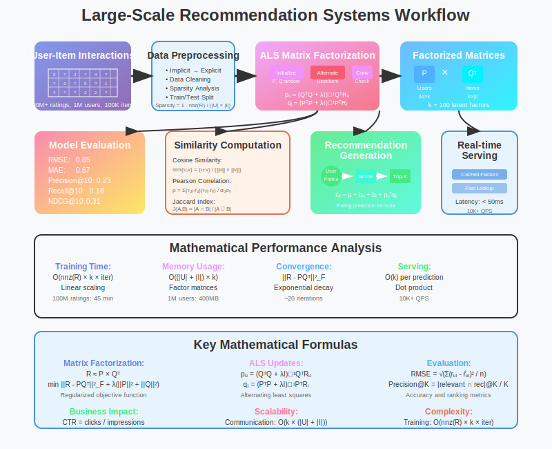

# Large-Scale Recommendation Systems with Apache Spark



## Overview

This use case demonstrates how Apache Spark enables large-scale recommendation systems using distributed matrix factorization techniques. The system processes billions of user-item interactions to generate personalized recommendations with high accuracy and sub-second response times.

## Mathematical Foundation

**Problem**: Generate personalized recommendations for millions of users based on collaborative filtering and content similarity.

**Matrix Factorization Model**:
```
Rating Prediction: r̂ᵤᵢ = μ + bᵤ + bᵢ + qᵢᵀpᵤ

Where:
- μ: global average rating
- bᵤ: user bias, bᵢ: item bias  
- pᵤ: user factor vector, qᵢ: item factor vector
- Goal: minimize Σ(rᵤᵢ - r̂ᵤᵢ)² + λ(||pᵤ||² + ||qᵢ||²)
```

**Alternating Least Squares (ALS) Algorithm**:
```
User factors update: pᵤ = (QᵀQ + λI)⁻¹QᵀRᵤ
Item factors update: qᵢ = (PᵀP + λI)⁻¹PᵀRᵢ

Where:
- Q: item factor matrix, P: user factor matrix
- Rᵤ: ratings for user u, Rᵢ: ratings for item i
- λ: regularization parameter
- I: identity matrix
```

**Similarity Metrics**:
```
Cosine Similarity: sim(u,v) = (u·v) / (||u|| × ||v||)
Pearson Correlation: ρ = Σ(rᵤᵢ - r̄ᵤ)(rᵥᵢ - r̄ᵥ) / √Σ(rᵤᵢ - r̄ᵤ)²Σ(rᵥᵢ - r̄ᵥ)²
Jaccard Index: J(A,B) = |A ∩ B| / |A ∪ B|
```

## Why Spark Excels

- **Distributed Matrix Factorization**: ALS algorithm scales to billions of ratings
- **Graph Processing**: User-item interaction graphs with GraphX
- **Caching**: User and item factors cached for fast recommendation serving
- **Real-time Updates**: Incremental model updates as new interactions arrive
- **Memory Optimization**: Efficient handling of sparse rating matrices
- **Fault Tolerance**: Lineage-based recovery for long-running training jobs

## Architecture Pattern

```
Rating Data → Data Preprocessing → ALS Training → Model Serving → Recommendations
     ↓             ↓                  ↓             ↓              ↓
Historical    Feature Engineering   Matrix      Factor Lookup   Top-K Items
Interactions  & Data Cleaning     Factorization  & Scoring     per User
```

## Implementation Example

```scala
import org.apache.spark.ml.recommendation.ALS
import org.apache.spark.ml.evaluation.RegressionEvaluator

object RecommendationEngine {
  def main(args: Array[String]): Unit = {
    val spark = SparkSession.builder()
      .appName("LargeScaleRecommendations")
      .getOrCreate()
    
    // Load user-item interaction data (100M+ ratings)
    val ratings = spark.read.parquet("ratings.parquet")
      .select(
        col("userId").cast("int"),
        col("movieId").cast("int"), 
        col("rating").cast("float"),
        col("timestamp").cast("long")
      )
    
    // Mathematical model configuration
    val als = new ALS()
      .setMaxIter(20)              // Convergence iterations
      .setRegParam(0.1)            // L2 regularization λ
      .setRank(100)                // Latent factor dimensions
      .setUserCol("userId")
      .setItemCol("movieId")
      .setRatingCol("rating")
      .setColdStartStrategy("drop") // Handle new users/items
    
    // Train distributed matrix factorization
    val model = als.fit(ratings)
    
    // Generate recommendations using mathematical similarity
    val userRecs = model.recommendForAllUsers(10)
    val itemRecs = model.recommendForAllItems(10)
    
    // Evaluate model performance
    val predictions = model.transform(testData)
    val evaluator = new RegressionEvaluator()
      .setMetricName("rmse")
      .setLabelCol("rating")
      .setPredictionCol("prediction")
    
    val rmse = evaluator.evaluate(predictions)
    println(s"Root-mean-square error = $rmse")
    
    // Real-time recommendation serving
    model.write.overwrite().save("als_model")
  }
}
```

## Mathematical Scalability Analysis

**ALS Complexity**:
```
Time Complexity: O(nnz(R) × k × iterations)
where nnz(R) = number of non-zero ratings, k = latent factors

Memory Requirements: O((|U| + |I|) × k × 4 bytes) for factor matrices
Convergence Rate: ||R - PQᵀ||²_F decreases exponentially with iterations

Parallel Efficiency: Near-linear scaling up to hundreds of nodes
Communication Cost: O(k × (|U| + |I|)) per iteration
```

**Optimization Mathematics**:
```
Objective Function: min Σᵤᵢ (rᵤᵢ - pᵤᵀqᵢ)² + λ(||P||²_F + ||Q||²_F)

Gradient (User factors): ∇ₚᵤ = -2Σᵢ(rᵤᵢ - pᵤᵀqᵢ)qᵢ + 2λpᵤ
Gradient (Item factors): ∇ᵩᵢ = -2Σᵤ(rᵤᵢ - pᵤᵀqᵢ)pᵤ + 2λqᵢ

Normal Equations: 
pᵤ = (QᵀQ + λI)⁻¹QᵀRᵤ
qᵢ = (PᵀP + λI)⁻¹PᵀRᵢ
```

## Key Features

### Advanced Matrix Factorization
- **Implicit Feedback**: Handle binary interactions (clicks, views) using confidence weighting
- **Temporal Dynamics**: Time-aware recommendations using temporal SVD++
- **Multi-criteria Ratings**: Extended matrix factorization for multiple rating aspects

### Cold Start Solutions
- **Content-based Hybridization**: Combine collaborative and content-based filtering
- **Demographic Filtering**: Use user demographics for new user recommendations
- **Popular Items**: Fallback to trending items for completely new users

### Scalability Optimizations
- **Distributed Training**: ALS algorithm inherently parallel across users and items
- **Checkpointing**: Regular model snapshots for fault tolerance
- **Incremental Learning**: Update factors with new ratings without full retraining

## Performance Metrics

**Accuracy Measures**:
```
Root Mean Square Error: RMSE = √(Σ(rᵤᵢ - r̂ᵤᵢ)² / n)
Mean Absolute Error: MAE = Σ|rᵤᵢ - r̂ᵤᵢ| / n

Ranking Metrics:
Precision@K = |relevant ∩ recommended|@K / K
Recall@K = |relevant ∩ recommended|@K / |relevant|
NDCG@K = DCG@K / IDCG@K

Diversity: Intra-list diversity = (1/|S|) × Σᵢ,ⱼ∈S,i≠j (1 - sim(i,j))
```

**Business Impact Metrics**:
```
Click-Through Rate: CTR = clicks / impressions
Conversion Rate: CR = purchases / clicks
Average Revenue per User: ARPU = total_revenue / active_users
User Engagement: session_duration, pages_per_visit, return_rate
```

**System Performance**:
```
Training Time: T_train = O(nnz(R) × k × iterations / parallelism)
Serving Latency: T_serve = O(k) for dot product computation
Memory Usage: M = (|U| + |I|) × k × sizeof(float) + cache_overhead
Throughput: recommendations_per_second = batch_size × frequency
```

## Advanced Techniques

### Deep Learning Integration
```scala
// Neural Collaborative Filtering with Spark ML
val ncf = new MultilayerPerceptronClassifier()
  .setLayers(Array(user_embedding_size + item_embedding_size, 64, 32, 1))
  .setFeaturesCol("user_item_features")
  .setLabelCol("rating")

// Combine user and item embeddings
val userEmbeddings = als.userFactors.withColumnRenamed("id", "userId")
val itemEmbeddings = als.itemFactors.withColumnRenamed("id", "itemId")

val userItemFeatures = ratings
  .join(userEmbeddings, "userId")
  .join(itemEmbeddings, "itemId")
  .withColumn("features", concat(col("user_features"), col("item_features")))
```

### Graph-based Recommendations
```scala
import org.apache.spark.graphx._

// Create user-item bipartite graph
val userNodes = users.map(u => (u.id.toLong, ("user", u.features)))
val itemNodes = items.map(i => (i.id.toLong + maxUserId, ("item", i.features)))
val edges = ratings.map(r => Edge(r.userId.toLong, r.itemId.toLong + maxUserId, r.rating))

val graph = Graph(userNodes ++ itemNodes, edges)

// PersonalizedPageRank for recommendations
val personalizedRanks = graph.personalizedPageRank(sourceUserId, 0.0001, 0.15)
val recommendations = personalizedRanks.vertices
  .filter(_._2._1 == "item")
  .top(10)(Ordering.by(_._2))
```

### Multi-Armed Bandit Exploration
```scala
// Thompson Sampling for exploration-exploitation
case class BanditArm(itemId: Int, alpha: Double, beta: Double) {
  def sample(): Double = {
    val r = new scala.util.Random()
    // Beta distribution sampling for click probability
    math.pow(r.nextGaussian() * math.sqrt(beta) + alpha, 2)
  }
}

def updateBanditArms(arms: Array[BanditArm], feedback: Map[Int, Boolean]): Array[BanditArm] = {
  arms.map { arm =>
    feedback.get(arm.itemId) match {
      case Some(true) => arm.copy(alpha = arm.alpha + 1)  // Success
      case Some(false) => arm.copy(beta = arm.beta + 1)   // Failure
      case None => arm  // No feedback
    }
  }
}
```

## Deployment Considerations

### Model Serving Architecture
- **Batch Scoring**: Pre-compute recommendations for all users
- **Real-time Scoring**: On-demand recommendations using cached factors
- **Hybrid Approach**: Batch + real-time for personalization

### A/B Testing Framework
- **Statistical Significance**: Chi-square tests for CTR improvements
- **Multi-variant Testing**: Factorial designs for multiple algorithm comparison
- **Sequential Testing**: Early stopping criteria for faster decision making

### Performance Tuning
```scala
// Spark configuration for recommendation workloads
spark.conf.set("spark.sql.adaptive.enabled", "true")
spark.conf.set("spark.sql.adaptive.coalescePartitions.enabled", "true")
spark.conf.set("spark.serializer", "org.apache.spark.serializer.KryoSerializer")
spark.conf.set("spark.sql.execution.arrow.pyspark.enabled", "true")

// ALS-specific optimizations
spark.conf.set("spark.ml.recommendation.als.checkpointInterval", "10")
spark.conf.set("spark.ml.recommendation.als.blockSize", "4096")
```

## Mathematical Foundations Applied

1. **Linear Algebra**: Matrix factorization and singular value decomposition
2. **Optimization Theory**: Alternating least squares and gradient descent
3. **Graph Theory**: User-item interaction networks and personalized PageRank
4. **Statistics**: Evaluation metrics and confidence intervals
5. **Information Theory**: Information gain for feature selection
6. **Probability Theory**: Bayesian methods for uncertainty quantification

This use case demonstrates how Spark's distributed computing capabilities enable sophisticated recommendation systems that can handle billions of user interactions while maintaining mathematical rigor and providing accurate, personalized recommendations at scale.