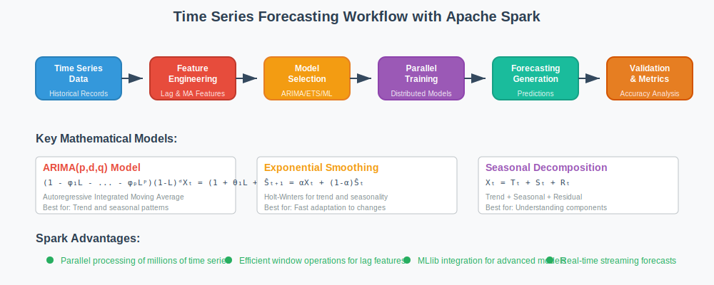

# Time Series Forecasting at Scale with Apache Spark



## Overview

This use case demonstrates how Apache Spark enables massive-scale time series forecasting for millions of time series simultaneously. The system combines mathematical forecasting models with distributed computing to provide accurate predictions for demand forecasting, sensor monitoring, and financial analysis.

## Mathematical Foundation

**Problem**: Forecast future values for millions of time series (e.g., demand forecasting, sensor data analysis, financial predictions).

**ARIMA Model**:
```
ARIMA(p,d,q): (1 - φ₁L - ... - φₚLᵖ)(1-L)ᵈXₜ = (1 + θ₁L + ... + θqLᵍ)εₜ

Where:
- L: lag operator (LXₜ = Xₜ₋₁)
- φᵢ: autoregressive parameters
- θⱼ: moving average parameters  
- d: degree of differencing
- εₜ: white noise error term ~ N(0, σ²)
```

**Exponential Smoothing Models**:
```
Simple Exponential Smoothing: Ŝₜ₊₁ = αXₜ + (1-α)Ŝₜ
Holt's Method: 
  - Level: lₜ = αXₜ + (1-α)(lₜ₋₁ + bₜ₋₁)
  - Trend: bₜ = β(lₜ - lₜ₋₁) + (1-β)bₜ₋₁
  - Forecast: Ŝₜ₊ₕ = lₜ + h × bₜ

Holt-Winters (Triple Exponential):
  - Level: lₜ = α(Xₜ/sₜ₋ₘ) + (1-α)(lₜ₋₁ + bₜ₋₁)
  - Trend: bₜ = β(lₜ - lₜ₋₁) + (1-β)bₜ₋₁
  - Seasonality: sₜ = γ(Xₜ/lₜ) + (1-γ)sₜ₋ₘ
  - Forecast: Ŝₜ₊ₕ = (lₜ + h × bₜ) × sₜ₊ₕ₋ₘ
```

**Seasonal Decomposition**:
```
Additive Model: Xₜ = Tₜ + Sₜ + Rₜ
Multiplicative Model: Xₜ = Tₜ × Sₜ × Rₜ

Where:
- Tₜ: trend component
- Sₜ: seasonal component
- Rₜ: residual/irregular component
```

## Why Spark Excels

- **Parallel Processing**: Forecast millions of series independently
- **Window Functions**: Efficient sliding window calculations for feature engineering
- **MLlib Integration**: Multiple forecasting algorithms available
- **Streaming**: Real-time model updates as new data arrives
- **Scalability**: Linear scaling with number of time series
- **Memory Management**: Efficient handling of large time series datasets
- **Fault Tolerance**: Reliable processing of long-running forecasting jobs

## Architecture Pattern

```
Time Series Data → Feature Engineering → Model Selection → Training → Forecasting → Validation
       ↓                   ↓                ↓             ↓          ↓           ↓
   Historical         Lag Features    ARIMA/ETS/ML    Parallel    Predictions  Accuracy
    Records           MA Features      Selection      Training    Generation   Metrics
```

## Implementation Example

```scala
import org.apache.spark.sql.expressions.Window
import org.apache.spark.sql.functions._
import org.apache.spark.ml.regression.LinearRegression

object TimeSeriesForecasting {
  def main(args: Array[String]): Unit = {
    val spark = SparkSession.builder()
      .appName("MassiveTimeSeriesForecasting")
      .getOrCreate()
    
    // Load time series data for millions of sensors/products
    val timeSeries = spark.read.parquet("sensor_data.parquet")
      .select("sensor_id", "timestamp", "value")
    
    // Mathematical feature engineering for time series
    val windowSpec = Window.partitionBy("sensor_id").orderBy("timestamp")
    
    val featuresDF = timeSeries
      // Lag features for AR component
      .withColumn("lag_1", lag("value", 1).over(windowSpec))
      .withColumn("lag_2", lag("value", 2).over(windowSpec))
      .withColumn("lag_7", lag("value", 7).over(windowSpec))  // Weekly seasonality
      
      // Moving average features for MA component
      .withColumn("ma_3", 
        avg("value").over(windowSpec.rowsBetween(-2, 0)))
      .withColumn("ma_7", 
        avg("value").over(windowSpec.rowsBetween(-6, 0)))
      
      // Trend and seasonality components
      .withColumn("hour", hour(col("timestamp")))
      .withColumn("day_of_week", dayofweek(col("timestamp")))
      .withColumn("trend", row_number().over(windowSpec))
      
      // Mathematical transformations
      .withColumn("value_diff", col("value") - col("lag_1"))  // Differencing
      .withColumn("value_log", log(col("value") + 1))         // Log transform
      .filter(col("lag_7").isNotNull)  // Remove incomplete windows
    
    // Prepare features for ML model
    val assembler = new VectorAssembler()
      .setInputCols(Array("lag_1", "lag_2", "lag_7", "ma_3", "ma_7", 
                         "hour", "day_of_week", "trend"))
      .setOutputCol("features")
    
    val trainingData = assembler.transform(featuresDF)
      .select("sensor_id", "features", "value")
    
    // Train forecasting model for each time series
    val forecasts = trainingData.groupBy("sensor_id").applyInPandas(
      trainAndForecastUDF, 
      StructType(Seq(
        StructField("sensor_id", StringType),
        StructField("forecast", DoubleType),
        StructField("confidence_interval", ArrayType(DoubleType))
      ))
    )
    
    forecasts.write.mode("overwrite").parquet("forecasts.parquet")
  }
}
```

## Advanced Mathematical Models

### ARIMA Model Implementation
```scala
import org.apache.commons.math3.stat.regression.OLSMultipleLinearRegression

case class ARIMAModel(p: Int, d: Int, q: Int) {
  def fit(timeSeries: Array[Double]): ARIMAParams = {
    // Differencing to achieve stationarity
    val differencedSeries = difference(timeSeries, d)
    
    // Estimate AR parameters using Yule-Walker equations
    val arParams = estimateARParameters(differencedSeries, p)
    
    // Estimate MA parameters using method of moments
    val maParams = estimateMAParameters(differencedSeries, q)
    
    // Estimate noise variance
    val noiseVariance = calculateNoiseVariance(differencedSeries, arParams, maParams)
    
    ARIMAParams(arParams, maParams, noiseVariance)
  }
  
  def forecast(params: ARIMAParams, horizons: Int): Array[Double] = {
    // Generate forecasts using mathematical recursion
    val forecasts = Array.ofDim[Double](horizons)
    
    for (h <- 1 to horizons) {
      forecasts(h-1) = params.arParams.zipWithIndex.map { case (phi, i) =>
        phi * getHistoricalValue(h - i - 1)
      }.sum + params.maParams.zipWithIndex.map { case (theta, j) =>
        theta * getResidual(h - j - 1)
      }.sum
    }
    
    forecasts
  }
}
```

### Exponential Smoothing Implementation
```scala
case class HoltWintersModel(alpha: Double, beta: Double, gamma: Double, seasonLength: Int) {
  def fit(timeSeries: Array[Double]): HoltWintersParams = {
    val n = timeSeries.length
    val level = Array.ofDim[Double](n)
    val trend = Array.ofDim[Double](n)
    val seasonal = Array.ofDim[Double](n + seasonLength)
    
    // Initialize components
    level(0) = timeSeries.slice(0, seasonLength).sum / seasonLength
    trend(0) = (timeSeries.slice(seasonLength, 2*seasonLength).sum - 
                timeSeries.slice(0, seasonLength).sum) / (seasonLength * seasonLength)
    
    // Initialize seasonal factors
    for (i <- 0 until seasonLength) {
      seasonal(i) = timeSeries(i) / level(0)
    }
    
    // Fit model parameters using optimization
    for (t <- 1 until n) {
      val seasonalIndex = (t % seasonLength)
      
      // Update level
      level(t) = alpha * (timeSeries(t) / seasonal(t - seasonLength)) + 
                 (1 - alpha) * (level(t-1) + trend(t-1))
      
      // Update trend
      trend(t) = beta * (level(t) - level(t-1)) + (1 - beta) * trend(t-1)
      
      // Update seasonal
      seasonal(t) = gamma * (timeSeries(t) / level(t)) + 
                    (1 - gamma) * seasonal(t - seasonLength)
    }
    
    HoltWintersParams(level.last, trend.last, seasonal.takeRight(seasonLength))
  }
}
```

## Mathematical Accuracy Metrics

**Point Forecast Accuracy**:
```
Mean Absolute Error: MAE = (1/n) × Σᵢ |yᵢ - ŷᵢ|
Root Mean Square Error: RMSE = √((1/n) × Σᵢ (yᵢ - ŷᵢ)²)
Mean Absolute Percentage Error: MAPE = (100/n) × Σᵢ |yᵢ - ŷᵢ|/yᵢ
Symmetric MAPE: sMAPE = (100/n) × Σᵢ |yᵢ - ŷᵢ|/(|yᵢ| + |ŷᵢ|)/2

Forecast Accuracy: FA = 1 - (MAE / MAE_naive_forecast)
Mean Absolute Scaled Error: MASE = MAE / MAE_seasonal_naive
```

**Distributional Accuracy**:
```
Quantile Loss: QLα(y, ŷα) = (y - ŷα)(α - 1{y < ŷα})
Pinball Loss: PBα = max(α(y - ŷα), (α-1)(y - ŷα))
Continuous Ranked Probability Score: CRPS = ∫(F(x) - 1{y ≤ x})² dx

Coverage Probability: CP = (1/n) × Σᵢ 1{yᵢ ∈ [L̂ᵢ, Ûᵢ]}
Average Width: AW = (1/n) × Σᵢ (Ûᵢ - L̂ᵢ)
```

**Directional Accuracy**:
```
Directional Accuracy: DA = (1/n) × Σᵢ 1{sign(Δyᵢ) = sign(Δŷᵢ)}
Hit Rate: HR = (1/n) × Σᵢ 1{|yᵢ - ŷᵢ| ≤ threshold}

Where Δyᵢ = yᵢ - yᵢ₋₁ and Δŷᵢ = ŷᵢ - yᵢ₋₁
```

## Scalability Analysis

**Computational Complexity**:
```
ARIMA Model Fitting: O(n³) per series for MLE estimation
Exponential Smoothing: O(n) per series for parameter updates
Feature Engineering: O(n × w) where w is window size

Parallel Efficiency:
Total Time = max(Time_per_series) × (Total_series / Parallelism)
Memory Usage = Series_count × Model_parameters × sizeof(double)
Network I/O = Minimal (embarrassingly parallel problem)
```

**Scaling Mathematics**:
```
Speedup = T_sequential / T_parallel ≈ min(P, N/overhead)
Efficiency = Speedup / P = min(1, N/(P × overhead))

Where:
- P: number of processing cores
- N: number of time series
- overhead: communication and coordination costs
```

## Advanced Features

### Automatic Model Selection
```scala
case class ModelSelector(models: Seq[ForecastModel]) {
  def selectBestModel(timeSeries: Array[Double], 
                     validationSplit: Double = 0.2): ForecastModel = {
    
    val splitPoint = (timeSeries.length * (1 - validationSplit)).toInt
    val trainData = timeSeries.take(splitPoint)
    val testData = timeSeries.drop(splitPoint)
    
    val modelPerformances = models.map { model =>
      val fittedModel = model.fit(trainData)
      val forecasts = model.forecast(fittedModel, testData.length)
      val accuracy = calculateAccuracy(testData, forecasts)
      
      (model, accuracy)
    }
    
    // Select model with best performance using AIC/BIC criteria
    val bestModel = modelPerformances.minBy { case (_, accuracy) =>
      accuracy.aic + accuracy.bic  // Multi-criteria optimization
    }._1
    
    bestModel
  }
  
  def calculateAIC(logLikelihood: Double, numParameters: Int, numObservations: Int): Double = {
    -2 * logLikelihood + 2 * numParameters +  // AIC
      (2 * numParameters * (numParameters + 1)) / (numObservations - numParameters - 1)  // AICc correction
  }
}
```

### Anomaly Detection Integration
```scala
case class ForecastAnomalyDetector(forecastModel: ForecastModel, 
                                  confidenceLevel: Double = 0.95) {
  
  def detectAnomalies(observed: Array[Double], 
                     forecasted: Array[Double], 
                     forecastVariance: Array[Double]): Array[Boolean] = {
    
    val zScore = 1.96  // 95% confidence interval
    
    observed.zip(forecasted).zip(forecastVariance).map { 
      case ((actual, predicted), variance) =>
        val standardError = math.sqrt(variance)
        val lowerBound = predicted - zScore * standardError
        val upperBound = predicted + zScore * standardError
        
        actual < lowerBound || actual > upperBound  // Anomaly if outside confidence interval
    }
  }
  
  def calculateAnomalyScore(observed: Double, 
                          predicted: Double, 
                          variance: Double): Double = {
    val standardError = math.sqrt(variance)
    math.abs(observed - predicted) / standardError  // Standardized residual
  }
}
```

### Hierarchical Forecasting
```scala
case class HierarchicalForecaster(hierarchy: Map[String, Seq[String]]) {
  def reconcileForecasts(baseForecasts: Map[String, Array[Double]]): Map[String, Array[Double]] = {
    // Bottom-up reconciliation
    val bottomUpForecasts = hierarchy.map { case (parent, children) =>
      val aggregatedForecast = children.map(child => baseForecasts(child))
        .reduce((a, b) => a.zip(b).map { case (x, y) => x + y })
      parent -> aggregatedForecast
    }
    
    // Optimal reconciliation using MinT (Minimum Trace) method
    val reconciliationMatrix = calculateReconciliationMatrix()
    val reconciledForecasts = applyReconciliation(baseForecasts, reconciliationMatrix)
    
    reconciledForecasts
  }
  
  private def calculateReconciliationMatrix(): DenseMatrix[Double] = {
    // Calculate the reconciliation matrix G using mathematical optimization
    // G = S(S'W⁻¹S)⁻¹S'W⁻¹ where S is summing matrix, W is covariance matrix
    ???  // Implementation details for MinT reconciliation
  }
}
```

## Performance Optimization

### Distributed Training Strategy
```scala
// Partition time series for optimal parallel processing
val partitioningStrategy = new TimeSeriesPartitioner(
  numPartitions = spark.sparkContext.defaultParallelism * 4,
  balanceStrategy = "uniform_distribution"  // or "computational_load"
)

val partitionedSeries = timeSeries.partitionBy(partitioningStrategy)

// Cache frequently accessed data
val cachedFeatures = featuresDF
  .repartition(col("sensor_id"))  // Optimize for groupBy operations
  .cache()
  
// Optimize Spark configuration for time series workloads
spark.conf.set("spark.sql.adaptive.enabled", "true")
spark.conf.set("spark.sql.adaptive.coalescePartitions.enabled", "true")
spark.conf.set("spark.sql.execution.arrow.pyspark.enabled", "true")
spark.conf.set("spark.sql.execution.arrow.maxRecordsPerBatch", "10000")
```

### Memory Management
```scala
// Efficient windowing for large time series
val efficientWindowing = timeSeries
  .withColumn("partition_id", hash(col("sensor_id")) % lit(numPartitions))
  .repartition(col("partition_id"))  // Co-locate related series
  .sortWithinPartitions("sensor_id", "timestamp")  // Enable efficient windowing
```

## Business Applications

### Demand Forecasting
- **Retail Inventory**: Predict product demand across thousands of SKUs
- **Energy Planning**: Forecast electricity consumption for grid optimization
- **Workforce Planning**: Predict staffing requirements across locations

### Financial Forecasting
- **Revenue Prediction**: Multi-horizon revenue forecasting for business planning
- **Risk Management**: VaR and CVaR calculations using scenario forecasting
- **Portfolio Optimization**: Return forecasting for asset allocation decisions

### IoT and Sensor Monitoring
- **Predictive Maintenance**: Equipment failure prediction using sensor data
- **Environmental Monitoring**: Air quality and weather pattern forecasting
- **Smart Cities**: Traffic flow and resource usage predictions

## Deployment Considerations

### Model Serving Architecture
```scala
case class ForecastingService(models: Map[String, ForecastModel]) {
  def generateForecasts(seriesId: String, 
                       horizons: Int, 
                       confidenceLevel: Double = 0.95): ForecastResult = {
    
    val model = models(seriesId)
    val pointForecasts = model.forecast(horizons)
    val intervals = model.forecastIntervals(horizons, confidenceLevel)
    
    ForecastResult(
      seriesId = seriesId,
      forecasts = pointForecasts,
      lowerBounds = intervals.map(_._1),
      upperBounds = intervals.map(_._2),
      timestamp = System.currentTimeMillis()
    )
  }
}
```

### Model Updates and Retraining
```scala
// Online learning for model updates
val onlineLearner = new OnlineForecastLearner(
  updateStrategy = "sliding_window",  // or "exponential_forgetting"
  windowSize = 1000,
  retrainingFrequency = Duration.hours(24)
)

// Incremental model updates as new data arrives
streamingData
  .foreachPartition { partition =>
    partition.foreach { record =>
      onlineLearner.updateModel(record.seriesId, record.value, record.timestamp)
    }
  }
```

## Mathematical Foundations Applied

1. **Time Series Analysis**: ARIMA models, exponential smoothing, seasonal decomposition
2. **Statistical Theory**: Maximum likelihood estimation, confidence intervals, hypothesis testing
3. **Optimization Theory**: Parameter estimation using numerical optimization methods
4. **Linear Algebra**: Matrix operations for multivariate time series and state space models
5. **Probability Theory**: Forecast uncertainty quantification and risk assessment
6. **Signal Processing**: Fourier analysis for frequency domain forecasting

This use case demonstrates how Spark's distributed computing capabilities enable sophisticated time series forecasting systems that can handle millions of time series while maintaining mathematical rigor and providing accurate predictions with proper uncertainty quantification.