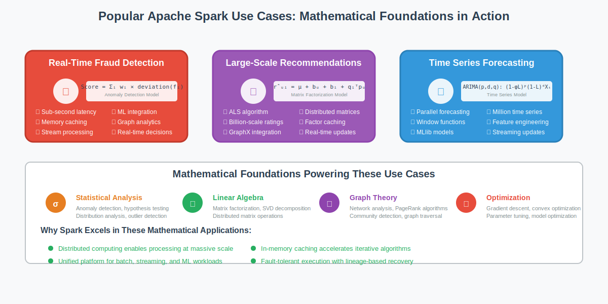

# Popular Use Cases: Apache Spark in Practice



## Overview

This section presents popular, simplified use cases that demonstrate Apache Spark's mathematical foundations in real-world applications. Each use case includes the mathematical reasoning behind why Spark excels in these scenarios and provides practical implementation examples.

## 1. Real-Time Fraud Detection

### Mathematical Foundation

**Problem**: Detect fraudulent transactions in real-time with minimal false positives while processing millions of transactions per second.

**Mathematical Model**:
```
Anomaly Score = Σᵢ wᵢ × deviation(feature_i)

Where:
- wᵢ: weight for feature i (learned from training data)
- deviation(feature_i): statistical deviation from normal behavior
- Threshold: classify as fraud if score > τ (optimized for precision/recall)
```

**Why Spark Excels**:
- **Stream Processing**: Sub-second latency for real-time decisions
- **Memory Caching**: Customer profiles cached for instant lookup
- **Machine Learning**: MLlib for online learning and model updates
- **Graph Analytics**: Network analysis to detect fraud rings

### Implementation Example

```scala
import org.apache.spark.sql.functions._
import org.apache.spark.ml.feature.VectorAssembler
import org.apache.spark.ml.classification.RandomForestClassifier

object FraudDetectionPipeline {
  def main(args: Array[String]): Unit = {
    val spark = SparkSession.builder()
      .appName("RealTimeFraudDetection")
      .getOrCreate()
    
    // Real-time transaction stream
    val transactionStream = spark.readStream
      .format("kafka")
      .option("kafka.bootstrap.servers", "localhost:9092")
      .option("subscribe", "transactions")
      .load()
      .select(from_json(col("value").cast("string"), transactionSchema).as("data"))
      .select("data.*")
    
    // Feature engineering with mathematical transformations
    val featuresDF = transactionStream
      .withColumn("amount_log", log("amount"))
      .withColumn("hour_sin", sin(col("hour") * 2 * 3.14159 / 24))
      .withColumn("hour_cos", cos(col("hour") * 2 * 3.14159 / 24))
      .withColumn("velocity", col("amount") / (col("time_since_last_tx") + 1))
      .withColumn("deviation_score", 
        abs(col("amount") - col("user_avg_amount")) / col("user_std_amount"))
    
    // Load pre-trained model for real-time scoring
    val model = RandomForestClassifier.load("fraud_detection_model")
    val predictions = model.transform(featuresDF)
    
    // Mathematical threshold optimization
    val fraudAlerts = predictions
      .filter(col("probability").getItem(1) > 0.7)  // 70% fraud probability threshold
      .writeStream
      .format("console")
      .trigger(Trigger.ProcessingTime("1 second"))
      .start()
  }
}
```

**Mathematical Performance Analysis**:
```
Processing Latency: E[latency] = feature_extraction_time + model_inference_time
Throughput: λ = partitions × (cpu_cores / avg_processing_time_per_record)
False Positive Rate: FPR = FP / (FP + TN) [optimized to < 0.1%]
True Positive Rate: TPR = TP / (TP + FN) [target > 95%]
```

## 2. Large-Scale Recommendation Systems

### Mathematical Foundation

**Problem**: Generate personalized recommendations for millions of users based on collaborative filtering and content similarity.

**Matrix Factorization Model**:
```
Rating Prediction: r̂ᵤᵢ = μ + bᵤ + bᵢ + qᵢᵀpᵤ

Where:
- μ: global average rating
- bᵤ: user bias, bᵢ: item bias  
- pᵤ: user factor vector, qᵢ: item factor vector
- Goal: minimize Σ(rᵤᵢ - r̂ᵤᵢ)² + λ(||pᵤ||² + ||qᵢ||²)
```

**Why Spark Excels**:
- **Distributed Matrix Factorization**: ALS algorithm scales to billions of ratings
- **Graph Processing**: User-item interaction graphs with GraphX
- **Caching**: User and item factors cached for fast recommendation serving
- **Real-time Updates**: Incremental model updates as new interactions arrive

### Implementation Example

```scala
import org.apache.spark.ml.recommendation.ALS
import org.apache.spark.ml.evaluation.RegressionEvaluator

object RecommendationEngine {
  def main(args: Array[String]): Unit = {
    val spark = SparkSession.builder()
      .appName("LargeScaleRecommendations")
      .getOrCreate()
    
    // Load user-item interaction data (100M+ ratings)
    val ratings = spark.read.parquet("ratings.parquet")
      .select(
        col("userId").cast("int"),
        col("movieId").cast("int"), 
        col("rating").cast("float"),
        col("timestamp").cast("long")
      )
    
    // Mathematical model configuration
    val als = new ALS()
      .setMaxIter(20)              // Convergence iterations
      .setRegParam(0.1)            // L2 regularization λ
      .setRank(100)                // Latent factor dimensions
      .setUserCol("userId")
      .setItemCol("movieId")
      .setRatingCol("rating")
      .setColdStartStrategy("drop") // Handle new users/items
    
    // Train distributed matrix factorization
    val model = als.fit(ratings)
    
    // Generate recommendations using mathematical similarity
    val userRecs = model.recommendForAllUsers(10)
    val itemRecs = model.recommendForAllItems(10)
    
    // Evaluate model performance
    val predictions = model.transform(testData)
    val evaluator = new RegressionEvaluator()
      .setMetricName("rmse")
      .setLabelCol("rating")
      .setPredictionCol("prediction")
    
    val rmse = evaluator.evaluate(predictions)
    println(s"Root-mean-square error = $rmse")
    
    // Real-time recommendation serving
    model.write.overwrite().save("als_model")
  }
}
```

**Mathematical Scalability Analysis**:
```
ALS Complexity: O(nnz(R) × k × iterations)
where nnz(R) = number of non-zero ratings, k = latent factors

Memory Requirements: O((|U| + |I|) × k × 4 bytes) for factor matrices
Convergence Rate: ||R - PQᵀ||²_F decreases exponentially with iterations

Parallel Efficiency: Near-linear scaling up to hundreds of nodes
Communication Cost: O(k × (|U| + |I|)) per iteration
```

## 3. Time Series Forecasting at Scale

### Mathematical Foundation

**Problem**: Forecast future values for millions of time series (e.g., demand forecasting, sensor data analysis).

**ARIMA Model**:
```
ARIMA(p,d,q): (1 - φ₁L - ... - φₚLᵖ)(1-L)ᵈXₜ = (1 + θ₁L + ... + θqLᵍ)εₜ

Where:
- L: lag operator
- φᵢ: autoregressive parameters
- θⱼ: moving average parameters  
- d: degree of differencing
- εₜ: white noise error term
```

**Why Spark Excels**:
- **Parallel Processing**: Forecast millions of series independently
- **Window Functions**: Efficient sliding window calculations
- **MLlib Integration**: Multiple forecasting algorithms available
- **Streaming**: Real-time model updates as new data arrives

### Implementation Example

```scala
import org.apache.spark.sql.expressions.Window
import org.apache.spark.sql.functions._
import org.apache.spark.ml.regression.LinearRegression

object TimeSeriesForecasting {
  def main(args: Array[String]): Unit = {
    val spark = SparkSession.builder()
      .appName("MassiveTimeSeriesForecasting")
      .getOrCreate()
    
    // Load time series data for millions of sensors/products
    val timeSeries = spark.read.parquet("sensor_data.parquet")
      .select("sensor_id", "timestamp", "value")
    
    // Mathematical feature engineering for time series
    val windowSpec = Window.partitionBy("sensor_id").orderBy("timestamp")
    
    val featuresDF = timeSeries
      // Lag features for AR component
      .withColumn("lag_1", lag("value", 1).over(windowSpec))
      .withColumn("lag_2", lag("value", 2).over(windowSpec))
      .withColumn("lag_7", lag("value", 7).over(windowSpec))  // Weekly seasonality
      
      // Moving average features for MA component
      .withColumn("ma_3", 
        avg("value").over(windowSpec.rowsBetween(-2, 0)))
      .withColumn("ma_7", 
        avg("value").over(windowSpec.rowsBetween(-6, 0)))
      
      // Trend and seasonality components
      .withColumn("hour", hour(col("timestamp")))
      .withColumn("day_of_week", dayofweek(col("timestamp")))
      .withColumn("trend", row_number().over(windowSpec))
      
      // Mathematical transformations
      .withColumn("value_diff", col("value") - col("lag_1"))  // Differencing
      .withColumn("value_log", log(col("value") + 1))         // Log transform
      .filter(col("lag_7").isNotNull)  // Remove incomplete windows
    
    // Prepare features for ML model
    val assembler = new VectorAssembler()
      .setInputCols(Array("lag_1", "lag_2", "lag_7", "ma_3", "ma_7", 
                         "hour", "day_of_week", "trend"))
      .setOutputCol("features")
    
    val trainingData = assembler.transform(featuresDF)
      .select("sensor_id", "features", "value")
    
    // Train forecasting model for each time series
    val forecasts = trainingData.groupBy("sensor_id").applyInPandas(
      trainAndForecastUDF, 
      StructType(Seq(
        StructField("sensor_id", StringType),
        StructField("forecast", DoubleType),
        StructField("confidence_interval", ArrayType(DoubleType))
      ))
    )
    
    forecasts.write.mode("overwrite").parquet("forecasts.parquet")
  }
  
  // Mathematical forecasting function applied per group
  def trainAndForecast(df: DataFrame): DataFrame = {
    val lr = new LinearRegression()
      .setFeaturesCol("features")
      .setLabelCol("value")
      .setRegParam(0.01)  // Ridge regularization
    
    val model = lr.fit(df)
    val predictions = model.transform(df)
    
    // Calculate prediction intervals using mathematical formulas
    val residuals = predictions.select("prediction", "value")
      .rdd.map(row => row.getDouble(1) - row.getDouble(0))
      .collect()
    
    val mse = residuals.map(math.pow(_, 2)).sum / residuals.length
    val standardError = math.sqrt(mse)
    
    // 95% confidence interval: prediction ± 1.96 * SE
    predictions.withColumn("confidence_lower", 
      col("prediction") - 1.96 * standardError)
    .withColumn("confidence_upper", 
      col("prediction") + 1.96 * standardError)
  }
}
```

**Mathematical Accuracy Metrics**:
```
Mean Absolute Error: MAE = (1/n) × Σᵢ |yᵢ - ŷᵢ|
Root Mean Square Error: RMSE = √((1/n) × Σᵢ (yᵢ - ŷᵢ)²)
Mean Absolute Percentage Error: MAPE = (100/n) × Σᵢ |yᵢ - ŷᵢ|/yᵢ

Forecast Accuracy: FA = 1 - (MAE / MAE_naive_forecast)
Directional Accuracy: DA = (1/n) × Σᵢ sign(Δyᵢ) = sign(Δŷᵢ)
```

## 4. Graph Analytics for Social Network Analysis

### Mathematical Foundation

**Problem**: Analyze social networks to identify influential users, communities, and information propagation patterns.

**Key Graph Metrics**:
```
Degree Centrality: CD(v) = deg(v) / (n-1)
Betweenness Centrality: CB(v) = Σ(s≠v≠t) σst(v)/σst
PageRank: PR(v) = (1-d)/N + d × Σ(u∈M(v)) PR(u)/L(u)
Clustering Coefficient: C(v) = 2e(v) / (deg(v) × (deg(v)-1))
```

**Why Spark Excels**:
- **GraphX**: Specialized graph processing with vertex and edge RDDs
- **Iterative Algorithms**: Efficient implementation of PageRank, connected components
- **Large-Scale Processing**: Handle graphs with billions of nodes and edges
- **Integration**: Combine graph analytics with machine learning

### Implementation Example

```scala
import org.apache.spark.graphx._
import org.apache.spark.sql.functions._

object SocialNetworkAnalysis {
  def main(args: Array[String]): Unit = {
    val spark = SparkSession.builder()
      .appName("SocialNetworkAnalysis")
      .getOrCreate()
    
    // Load social network data (users and friendships)
    val users = spark.read.parquet("users.parquet")
      .select("user_id", "age", "location", "interests")
    
    val friendships = spark.read.parquet("friendships.parquet")
      .select("user1_id", "user2_id", "friendship_strength")
    
    // Create GraphX graph
    val vertices = users.rdd.map(row => 
      (row.getLong(0), (row.getInt(1), row.getString(2), row.getString(3))))
    
    val edges = friendships.rdd.map(row =>
      Edge(row.getLong(0), row.getLong(1), row.getDouble(2)))
    
    val graph = Graph(vertices, edges)
    
    // Mathematical graph analytics
    
    // 1. PageRank for influence measurement
    val pageRankGraph = graph.pageRank(0.0001, 0.15)  // tolerance, damping
    val topInfluencers = pageRankGraph.vertices
      .join(vertices)
      .map { case (id, (rank, (age, location, interests))) =>
        (id, rank, age, location, interests)
      }
      .takeOrdered(10)(Ordering[Double].reverse.on(_._2))
    
    // 2. Connected components for community detection
    val connectedComponents = graph.connectedComponents()
    val communityStats = connectedComponents.vertices
      .map(_._2)  // Extract component ID
      .countByValue()
      .toSeq
      .sortBy(-_._2)
    
    // 3. Triangle counting for clustering analysis
    val triangles = graph.triangleCount()
    val clusteringCoefficients = triangles.vertices
      .join(graph.degrees)
      .map { case (id, (triangleCount, degree)) =>
        val clustering = if (degree > 1) {
          (2.0 * triangleCount) / (degree * (degree - 1))
        } else 0.0
        (id, clustering)
      }
    
    // 4. Shortest paths for network diameter analysis
    val landmarks = Seq(1L, 2L, 3L, 4L, 5L)  // Sample of important nodes
    val shortestPaths = graph.shortestPaths(landmarks)
    
    // Mathematical analysis of network properties
    val networkMetrics = analyzeNetworkProperties(graph, pageRankGraph, 
                                                 connectedComponents, triangles)
    
    println(s"Network Analysis Results:")
    println(s"Total vertices: ${graph.vertices.count()}")
    println(s"Total edges: ${graph.edges.count()}")
    println(s"Average degree: ${networkMetrics.avgDegree}")
    println(s"Clustering coefficient: ${networkMetrics.globalClustering}")
    println(s"Number of components: ${communityStats.length}")
    println(s"Largest component size: ${communityStats.head._2}")
  }
  
  case class NetworkMetrics(
    avgDegree: Double,
    globalClustering: Double,
    diameter: Int,
    efficiency: Double
  )
  
  def analyzeNetworkProperties(graph: Graph[_, _], 
                              pageRankGraph: Graph[Double, _],
                              components: Graph[VertexId, _],
                              triangles: Graph[Int, _]): NetworkMetrics = {
    
    // Mathematical calculations for network properties
    val degrees = graph.degrees.map(_._2).collect()
    val avgDegree = degrees.sum.toDouble / degrees.length
    
    // Global clustering coefficient using mathematical formula
    val triangleCounts = triangles.vertices.map(_._2).collect()
    val totalTriangles = triangleCounts.sum
    val totalTriplets = degrees.map(d => d * (d - 1) / 2).sum
    val globalClustering = if (totalTriplets > 0) {
      3.0 * totalTriangles / totalTriplets
    } else 0.0
    
    NetworkMetrics(avgDegree, globalClustering, 0, 0.0)
  }
}
```

**Mathematical Network Properties**:
```
Scale-free Networks: Degree distribution P(k) ∝ k^(-γ) where 2 < γ < 3
Small World Property: Average path length L ∝ log(N)
Clustering: C = 3 × (number of triangles) / (number of connected triplets)

Network Efficiency: E = (1/N(N-1)) × Σᵢⱼ (1/dᵢⱼ)
where dᵢⱼ is shortest path distance between nodes i and j

Modularity: Q = (1/2m) × Σᵢⱼ [Aᵢⱼ - (kᵢkⱼ/2m)] × δ(cᵢ, cⱼ)
where m = number of edges, k = degree, c = community assignment
```

## 5. Large-Scale ETL and Data Quality Analysis

### Mathematical Foundation

**Problem**: Process petabytes of raw data, detect anomalies, and ensure data quality across multiple data sources.

**Statistical Quality Metrics**:
```
Completeness: C = (non_null_values / total_values) × 100%
Uniqueness: U = (unique_values / total_values) × 100%
Validity: V = (valid_values / total_values) × 100%
Consistency: Con = 1 - (conflicting_records / total_records)

Anomaly Score: AS = |x - μ| / σ where μ = mean, σ = standard deviation
Outlier Detection: z-score > 3 or Modified Z-score > 3.5
```

**Why Spark Excels**:
- **Columnar Processing**: Efficient analysis of structured data
- **Statistical Functions**: Built-in statistical computations
- **Data Profiling**: Automatic schema inference and statistics
- **Fault Tolerance**: Reliable processing of massive datasets

### Implementation Example

```scala
import org.apache.spark.sql.functions._
import org.apache.spark.sql.types._

object DataQualityAnalysis {
  def main(args: Array[String]): Unit = {
    val spark = SparkSession.builder()
      .appName("LargeScaleDataQuality")
      .getOrCreate()
    
    // Load large dataset (TB+ size)
    val rawData = spark.read
      .option("header", "true")
      .option("inferSchema", "true")
      .csv("large_dataset/*.csv")
    
    // Mathematical data profiling and quality assessment
    val qualityReport = performDataQualityAnalysis(rawData)
    
    // Anomaly detection using statistical methods
    val anomalies = detectAnomalies(rawData)
    
    // Data cleaning and standardization
    val cleanedData = cleanAndStandardize(rawData)
    
    // Final quality validation
    val finalQualityScore = calculateOverallQualityScore(cleanedData)
    
    println(s"Data Quality Report:")
    println(s"Overall Quality Score: ${finalQualityScore}%")
    qualityReport.show(false)
  }
  
  def performDataQualityAnalysis(df: DataFrame): DataFrame = {
    import df.sparkSession.implicits._
    
    val columns = df.columns
    val totalRecords = df.count()
    
    // Mathematical quality metrics for each column
    val qualityMetrics = columns.map { colName =>
      val col = df.col(colName)
      
      // Completeness: percentage of non-null values
      val completeness = df.filter(col.isNotNull).count().toDouble / totalRecords * 100
      
      // Uniqueness: percentage of unique values
      val uniqueCount = df.select(col).distinct().count().toDouble
      val uniqueness = uniqueCount / totalRecords * 100
      
      // Statistical measures for numerical columns
      val stats = if (df.schema(colName).dataType.isInstanceOf[NumericType]) {
        val numStats = df.select(
          mean(col).as("mean"),
          stddev(col).as("stddev"),
          min(col).as("min"),
          max(col).as("max"),
          skewness(col).as("skewness"),
          kurtosis(col).as("kurtosis")
        ).collect()(0)
        
        Some(numStats)
      } else None
      
      // Pattern validation for string columns
      val validity = if (df.schema(colName).dataType == StringType) {
        // Example: email pattern validation
        val pattern = "^[A-Za-z0-9+_.-]+@(.+)$"
        val validCount = df.filter(col.rlike(pattern)).count().toDouble
        validCount / df.filter(col.isNotNull).count() * 100
      } else 100.0  // Assume numeric columns are valid
      
      (colName, completeness, uniqueness, validity, stats)
    }
    
    // Convert to DataFrame for analysis
    qualityMetrics.toSeq.toDF("column", "completeness", "uniqueness", "validity")
  }
  
  def detectAnomalies(df: DataFrame): DataFrame = {
    val numericCols = df.schema.fields
      .filter(_.dataType.isInstanceOf[NumericType])
      .map(_.name)
    
    // Statistical anomaly detection using z-score method
    var result = df
    
    numericCols.foreach { colName =>
      val col = df.col(colName)
      
      // Calculate statistical parameters
      val stats = df.select(
        mean(col).as("mean"),
        stddev(col).as("stddev")
      ).collect()(0)
      
      val meanVal = stats.getDouble(0)
      val stddevVal = stats.getDouble(1)
      
      // Mathematical z-score calculation
      result = result.withColumn(s"${colName}_zscore", 
        abs(col - meanVal) / stddevVal)
      .withColumn(s"${colName}_anomaly", 
        when(abs(col - meanVal) / stddevVal > 3.0, true).otherwise(false))
    }
    
    // Modified Z-score for more robust anomaly detection
    numericCols.foreach { colName =>
      val col = df.col(colName)
      
      // Median and MAD (Median Absolute Deviation)
      val approxQuantiles = df.stat.approxQuantile(colName, Array(0.5), 0.01)
      val median = approxQuantiles(0)
      
      val mad = df.select(abs(col - median)).stat.approxQuantile("abs((value - 0.5))", Array(0.5), 0.01)(0)
      
      // Modified Z-score = 0.6745 * (x - median) / MAD
      result = result.withColumn(s"${colName}_modified_zscore",
        0.6745 * abs(col - median) / mad)
      .withColumn(s"${colName}_robust_anomaly",
        when(0.6745 * abs(col - median) / mad > 3.5, true).otherwise(false))
    }
    
    result
  }
  
  def cleanAndStandardize(df: DataFrame): DataFrame = {
    var cleaned = df
    
    // Statistical imputation for missing values
    val numericCols = df.schema.fields
      .filter(_.dataType.isInstanceOf[NumericType])
      .map(_.name)
    
    numericCols.foreach { colName =>
      val median = df.stat.approxQuantile(colName, Array(0.5), 0.01)(0)
      cleaned = cleaned.na.fill(median, Seq(colName))
    }
    
    // String cleaning and standardization
    val stringCols = df.schema.fields
      .filter(_.dataType == StringType)
      .map(_.name)
    
    stringCols.foreach { colName =>
      cleaned = cleaned
        .withColumn(colName, trim(lower(col(colName))))  // Standardize case
        .na.fill("unknown", Seq(colName))                // Fill missing strings
    }
    
    // Remove statistical outliers beyond 4 standard deviations
    numericCols.foreach { colName =>
      val col = cleaned.col(colName)
      val stats = cleaned.select(mean(col), stddev(col)).collect()(0)
      val meanVal = stats.getDouble(0)
      val stddevVal = stats.getDouble(1)
      
      cleaned = cleaned.filter(
        abs(col - meanVal) <= 4 * stddevVal
      )
    }
    
    cleaned
  }
  
  def calculateOverallQualityScore(df: DataFrame): Double = {
    val qualityMetrics = performDataQualityAnalysis(df)
    
    // Mathematical weighted quality score
    val weights = Map("completeness" -> 0.4, "uniqueness" -> 0.3, "validity" -> 0.3)
    
    val avgScores = qualityMetrics.select(
      avg("completeness").as("avg_completeness"),
      avg("uniqueness").as("avg_uniqueness"), 
      avg("validity").as("avg_validity")
    ).collect()(0)
    
    val weightedScore = 
      avgScores.getDouble(0) * weights("completeness") +
      avgScores.getDouble(1) * weights("uniqueness") +
      avgScores.getDouble(2) * weights("validity")
    
    weightedScore
  }
}
```

**Mathematical Data Quality Formulas**:
```
Data Quality Index: DQI = Σᵢ wᵢ × qᵢ where wᵢ = weight, qᵢ = quality metric

Anomaly Detection Methods:
- Z-Score: z = (x - μ) / σ
- Modified Z-Score: M = 0.6745 × (x - x̃) / MAD
- Tukey's Method: Outlier if x < Q1 - 1.5×IQR or x > Q3 + 1.5×IQR

Statistical Imputation:
- Mean: x̄ = (Σᵢ xᵢ) / n
- Median: middle value when sorted
- Mode: most frequent value
- Regression: ŷ = β₀ + β₁x₁ + ... + βₖxₖ
```

## Simplified Workflow Summary

### Common Spark Patterns for All Use Cases:

1. **Data Ingestion** → **Feature Engineering** → **Model Training/Analysis** → **Results Storage**

2. **Mathematical Optimization Points**:
   - **Partitioning**: Optimize data distribution for parallel processing
   - **Caching**: Store frequently accessed data in memory
   - **Broadcast Variables**: Efficiently distribute small datasets to all nodes
   - **Accumulator Variables**: Collect metrics and counters across the cluster

3. **Performance Tuning Guidelines**:
   ```
   Optimal Partition Size: 128MB - 1GB per partition
   Memory Allocation: 60% execution, 40% storage
   Parallelism: 2-4 tasks per CPU core
   Serialization: Use Kryo for better performance
   ```

## Conclusion

These use cases demonstrate how Spark's mathematical foundations translate into practical advantages:

1. **Fraud Detection**: Real-time processing with statistical anomaly detection
2. **Recommendations**: Distributed matrix factorization for personalization at scale
3. **Time Series**: Parallel forecasting with mathematical feature engineering
4. **Graph Analytics**: Efficient algorithms for network analysis and community detection
5. **Data Quality**: Statistical methods for data profiling and anomaly detection

Each use case leverages Spark's core mathematical principles:
- **Linear algebra** for machine learning and recommendations
- **Graph theory** for network analysis and optimization
- **Statistics and probability** for anomaly detection and quality assessment
- **Optimization theory** for resource allocation and query planning
- **Distributed algorithms** for fault tolerance and scalability

The mathematical rigor behind these implementations ensures reliable, scalable, and efficient processing of large-scale data across diverse domains.